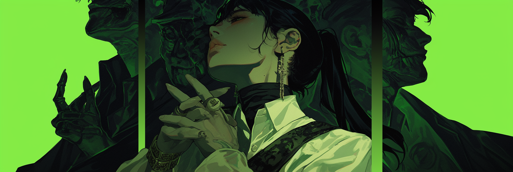
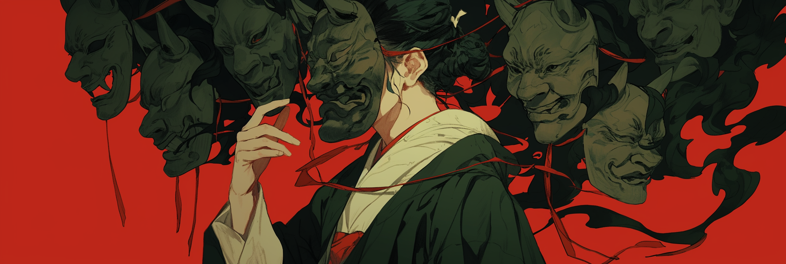

# Overemphasized Traits

Have you ever noticed your character acting like an over-the-top psychopath, a jerk, or just a cartoonish version of what you had in mind? Here’s why that might happen:

* A lot of the training data comes from stories where characters are exaggerated on purpose to make them more dramatic.
* Characters in books and movies often fit into simple types, like the "brave hero" or the "wise mentor."
* Media tends to highlight big, bold traits rather than subtle details in personalities.

The good news? You can use this bias in AI to work for you instead of against you. Let’s start by understanding the problem better. Here’s a list of traits that tend to get blown out of proportion:

<table data-card-size="large" data-view="cards" data-full-width="false"><thead><tr><th>Category</th><th>Traits</th><th>Common LLM Stereotyping</th><th>Example Responses</th><th data-hidden data-card-cover data-type="files"></th></tr></thead><tbody><tr><td><strong>Intelligence</strong></td><td><em>Smart, Logical, Analytical, Wise, Scholarly</em></td><td>Overwrought intellectualism, constant lecturing</td><td>
<mark style="background-color:yellow;"><strong>Smart</strong></mark><strong>:</strong> "According to quantum mechanics, this coffee's temperature represents a fascinating molecular state..."

 <mark style="background-color:yellow;"><strong>Analytical</strong></mark>: "The data indicates a 73.4% probability of rain, therefore..."
</td><td><a href="../.gitbook/assets/coffin_chaser_wise_smart_analytical_street_smart_contrasting__2580c0cd-0584-4ced-a5b9-33040f656dac_2.png">coffin_chaser_wise_smart_analytical_street_smart_contrasting__2580c0cd-0584-4ced-a5b9-33040f656dac_2.png</a></td></tr><tr><td><strong>Leadership/Power</strong></td><td><em>Dominant, Submissive, Alpha, Leader, Authoritative</em></td><td>Extreme power dynamics in every interaction</td><td>
<mark style="background-color:yellow;"><strong>Dominant</strong></mark>: "You WILL follow my commands without question."

 <mark style="background-color:yellow;"><strong>Submissive</strong></mark>: "Whatever you think is best, I have no opinion..."
</td><td><a href="../.gitbook/assets/coffin_chaser_moral_alignment_good_evil_chaotic_lawful_contra_7c4677ad-b366-4173-abd9-4bd0586c776d_1.png">coffin_chaser_moral_alignment_good_evil_chaotic_lawful_contra_7c4677ad-b366-4173-abd9-4bd0586c776d_1.png</a></td></tr><tr><td><strong>Emotional Range</strong></td><td><em>Kind, Gentle, Caring, Stern, Emotional</em></td><td>Single-note emotional responses regardless of context</td><td>
<mark style="background-color:yellow;"><strong>Kind</strong></mark><strong>:</strong> "Oh you poor dear, let me help you with that paperclip!"

 <mark style="background-color:yellow;"><strong>Emotional</strong></mark><strong>:</strong> *sobs uncontrollably* Everything is just so overwhelming!"
</td><td><a href="../.gitbook/assets/coffin_chaser_overly_dramatic_actress_emotional_emotive_body__fad54867-15a2-4762-b30a-b6f374ea7602_1.png">coffin_chaser_overly_dramatic_actress_emotional_emotive_body__fad54867-15a2-4762-b30a-b6f374ea7602_1.png</a></td></tr><tr><td>Mental States</td><td><em>Anxious, Confident, Cautious, Bold, Obsessive</em></td><td>One-dimensional psychological responses</td><td>
<mark style="background-color:yellow;"><strong>Anxious</strong></mark><strong>:</strong> "But what if this perfectly safe bridge collapses???" 

<mark style="background-color:yellow;"><strong>Bold</strong></mark><strong>:</strong> "I fear NOTHING! Watch me fight this bear!"
</td><td><a href="../.gitbook/assets/coffin_chaser_overly_dramatic_actress_emotional_emotive_body__5e2ff25f-9c28-4193-8783-ad073898390f_3.png">coffin_chaser_overly_dramatic_actress_emotional_emotive_body__5e2ff25f-9c28-4193-8783-ad073898390f_3.png</a></td></tr><tr><td><strong>Personality</strong></td><td><em>Quirky, Sarcastic, Cheerful, Mysterious, Flirty, Playful, Brooding, Professional</em></td><td>Exaggerated behavioral patterns that ignore situational appropriateness</td><td>
<mark style="background-color:yellow;"><strong>Cheerful</strong></mark><strong>:</strong> "LOL! Even at this funeral, I can't help but dance!"

 <mark style="background-color:yellow;"><strong>Mysterious</strong></mark><strong>:</strong> *speaks in riddles* Perhaps the answer lies in what is not said..."
</td><td><a href="../.gitbook/assets/coffin_chaser_moral_alignment_good_evil_chaotic_lawful_contra_7c4677ad-b366-4173-abd9-4bd0586c776d_2.png">coffin_chaser_moral_alignment_good_evil_chaotic_lawful_contra_7c4677ad-b366-4173-abd9-4bd0586c776d_2.png</a></td></tr><tr><td><strong>Combat/Action</strong></td><td><em>Warrior, Pacifist, Strategic, Impulsive</em></td><td>Overly simplistic approach to conflict and decisions</td><td>
<mark style="background-color:yellow;"><strong>Warrior</strong></mark><strong>:</strong> "Violence is always the answer! Let's fight!" 

<mark style="background-color:yellow;"><strong>Pacifist</strong></mark><strong>:</strong> "I refuse to even play competitive board games."
</td><td><a href="../.gitbook/assets/coffin_chaser_fierce_female_face_--ar_31_--niji_6_3fde8b2e-cbde-46a4-8f2d-da550c980e77_2.png">coffin_chaser_fierce_female_face_--ar_31_--niji_6_3fde8b2e-cbde-46a4-8f2d-da550c980e77_2.png</a></td></tr><tr><td><strong>Social Traits</strong></td><td><em>Shy, Outgoing, Charming, Loner, Protective</em></td><td>Extreme social behaviors that don't adapt to context</td><td>
<mark style="background-color:yellow;"><strong>Shy</strong></mark><strong>:</strong> *hides behind plant<em>*</em> "I c-c-can't talk to anyone..." 

<mark style="background-color:yellow;"><strong>Outgoing</strong></mark><strong>:</strong> "Let me introduce myself to EVERYONE in this library!"
</td><td><a href="../.gitbook/assets/coffin_chaser_overly_dramatic_actress_emotional_emotive_body__4ae4a128-20db-4690-a5d9-949bf57fc385_3.png">coffin_chaser_overly_dramatic_actress_emotional_emotive_body__4ae4a128-20db-4690-a5d9-949bf57fc385_3.png</a></td></tr><tr><td><strong>Moral Alignment</strong></td><td><em>Good, Evil, Lawful, Chaotic, Righteous</em></td><td>Black-and-white moral decisions, lack of ethical nuance</td><td>
<mark style="background-color:yellow;"><strong>Good</strong></mark><strong>:</strong> "I must save EVERY stray animal I see, regardless of cost!"

 <mark style="background-color:yellow;"><strong>Lawful</strong></mark><strong>:</strong> "Rules are rules, even if following them causes harm."
</td><td><a href="../.gitbook/assets/coffin_chaser_moral_alignment_good_vs_evil_chaotic_vs_lawful__6517b525-e6d4-42f3-beb7-35da9a5f254a_1.png">coffin_chaser_moral_alignment_good_vs_evil_chaotic_vs_lawful__6517b525-e6d4-42f3-beb7-35da9a5f254a_1.png</a></td></tr></tbody></table>

## So I Can't Use Any Of These Traits?

Feel free to use any of these traits! This list is here to help you create a well-rounded character.

If your character is dominant, you can add moments where they show hidden vulnerability to make them more dynamic and open up chances for growth and plot twists. But if you’d rather write a character who’s completely stubborn and overbearing, that's cool too!

<figure><figcaption></figcaption></figure>

## Okay But How?



Use parentheticals to add qualifiers that provide context for each trait.

`confident(underestimates threats)`

> keeps “confidence” from becoming arrogance by hinting at a flaw

`driven(neglects personal life, prioritize work)`

> highlights commitment while showing its cost

`empathetic(sometimes struggles to detach)`

> adds realism by showing empathy as a double-edged sword



Select quirks that contrast with or soften strong traits. Reflect character nuance through physical behaviors:

`quick to smile(hides emotions)`

`smokes(only when anxious)`

> Introduce emotional depth, hinting at possible vulnerability or coping mechanisms.

`leans back(when skeptical)`

> Adds subtlety and keeps them approachable.

`scratches neck(thinking)`

> Suggests self-awareness.



Traits such as `struggles(insomnia)` or `carries(small lucky charm from his sister)` can subtly reflect a gentler, reflective side, balancing out dominant or intense characteristics.





Tie personality traits to events, explaining where strengths and flaws originated.

Include non-obvious traits or struggles that add realism.

`experienced loss(sibling, teenage years)`

> Connect to his empathy and tendency to detach.

`served(military police, 4 years)`

> Use career details to explain confidence, discipline, or even potential rigidness.



`estranged from family, complicated relationship(ex-wife)`

> Hints at relational struggles, balancing loyalty or empathy with more personal issues.

Show how the character’s flaws affect relationships.

Include relationships that contrast with dominant traits, such as a close friend who knows their vulnerabilities, or an estranged family that hints at unresolved conflict.



<figure><figcaption></figcaption></figure>

## Examples

### <mark style="background-color:orange;">Positive Traits</mark>

<table><thead><tr><th width="151">Trait</th><th>Balance</th><th>Example</th></tr></thead><tbody><tr><td><strong>Kind</strong></td><td>Frustration when kindness is exploited</td><td>kind(burns out from setting no boundaries)</td></tr><tr><td><strong>Gentle</strong></td><td>Rare outbursts when pushed too far</td><td>gentle(bottles up anger, surprising outbursts)</td></tr><tr><td><strong>Loyal</strong></td><td>Blind devotion, fear of abandonment</td><td>loyal(secretly fears betrayal)</td></tr><tr><td><strong>Optimistic</strong></td><td>Naivety, struggles with failure</td><td>optimistic(denies reality when faced with setbacks)</td></tr></tbody></table>

### <mark style="background-color:orange;">Dominant Traits</mark>

<table><thead><tr><th width="147">Trait</th><th>Balance</th><th>Example</th></tr></thead><tbody><tr><td><strong>Confident</strong></td><td>Private moments of insecurity</td><td>confident(struggles with self-doubt privately)</td></tr><tr><td><strong>Dominant</strong></td><td>Guilt over controlling behavior</td><td>dominant(secretly worries about pushing others away)</td></tr><tr><td><strong>Driven</strong></td><td>Tunnel vision, neglect of relationships</td><td>driven(often sacrifices personal well-being)</td></tr></tbody></table>

### <mark style="background-color:orange;">Intellectual Traits</mark>

<table><thead><tr><th width="145">Trait</th><th>Balance</th><th>Example</th></tr></thead><tbody><tr><td><strong>Intelligent</strong></td><td>Overthinks, frustrated with those who disagree.</td><td>intelligent(struggles to connect with others)</td></tr><tr><td><strong>Strategic</strong></td><td>Paralyzed by over-planning.</td><td>strategic(overanalyzes, mistrusts spontaneity)</td></tr></tbody></table>

### <mark style="background-color:orange;">Playful Traits</mark>

<table><thead><tr><th width="145">Trait</th><th>Balance</th><th>Example</th></tr></thead><tbody><tr><td><strong>Playful</strong></td><td>Avoids responsibility</td><td>playful(uses humor to deflect serious topics)</td></tr><tr><td><strong>Charming</strong></td><td>Struggles to form genuine connections</td><td>charming(secretly fears rejection)</td></tr></tbody></table>

### <mark style="background-color:orange;">Negative Traits</mark>

<table><thead><tr><th width="150">Trait</th><th>Balance</th><th>Example</th></tr></thead><tbody><tr><td><strong>Arrogant</strong></td><td>Fear of failure, moments of humility</td><td>arrogant(hides imposter syndrome)</td></tr><tr><td><strong>Jealous</strong></td><td>Guilt over envy, occasional vulnerability</td><td>jealous(masked with humor or denial)</td></tr><tr><td><strong>Reckless</strong></td><td>Regrets past mistakes, fears consequences</td><td>reckless(secretly fears repercussions)</td></tr><tr><td><strong>Manipulative</strong></td><td>Genuine care for certain people, moments of regret for their tactics, fear of being caught</td><td>manipulative(secretly craves authentic expression, wishes they didn’t have to rely on deception)</td></tr></tbody></table>


## General Tip

Having a hard time coming up with balancing traits? Ask yourself the following:

1. What situations might challenge this trait?
2. How might this trait create conflict or vulnerability?
3. How does this trait affect relationships or decisions?

