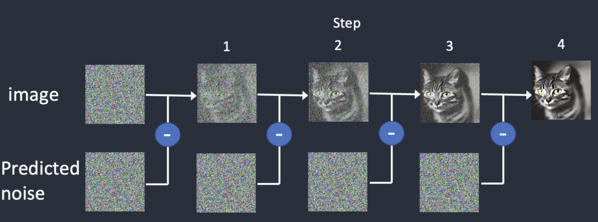

# Parameters

## [Stable Diffusion](https://stable-diffusion-art.com/install-windows/)

<figure><figcaption><p>Reverse diffusion works by subtracting the predicted noise from the image successively.</p></figcaption></figure>

### **Weighting Syntax**

Stable Diffusion supports both **parentheses** and **numerical weights** for emphasis:

* **Emphasis:**
  * `(keyword)` increases emphasis slightly.
  * `((keyword))` increases it more significantly.
  * `(((keyword)))` or additional parentheses for even stronger emphasis.
* **De-emphasis:**
  * `[keyword]` reduces the importance of the keyword.
* **Numerical Weights:**
  * Use `keyword:weight` to directly set the weight.
  * Example: `a cat:1.5, a dog:0.5` gives more prominence to "cat" than "dog."
  * Typical weights range from `0.0` (ignore) to `2.0` (high emphasis).

<details>

<summary>Combining Weighted Terms</summary>

Stable Diffusion allows complex prompts with weighted phrases:

*   **Example Prompt:**

    
    ```
    A beautiful ((sunset over the ocean)):1.5, [a city skyline]:0.7, colorful skies:1.2
    ```
    

    * This prioritizes the sunset while de-emphasizing the city skyline.

</details>

<details>

<summary>Impact of Weighting</summary>

Weights directly influence the model’s focus, but the results depend on:

* **Model Training Data**: Some concepts or terms may already be prominent or weak due to the dataset.
* **Prompt Complexity**: Overloading the prompt with high-emphasis terms can dilute results.
* **Inherent Ambiguity**: The model interprets prompts probabilistically, so multiple runs might slightly differ.

</details>

<details>

<summary>Using AND/OR for Advanced Control</summary>

You can separate concepts using `AND` for better multi-object composition:

*   **Example:**

    ```
    A futuristic city:1.2 AND a dragon flying in the sky:0.8
    ```

    * This creates a balance between the city and dragon elements

</details>

<details>

<summary>Examples</summary>

*   **Detailed Portrait:**

    
    ```
    A ((realistic portrait)) of a woman with blue eyes:1.3, wearing a red scarf:1.0 --negative (blurry), (cartoonish)
    ```
    

-   **Fantasy Scene:**

    
    ```
    A magical forest with glowing mushrooms:1.5 AND a fairy with delicate wings:1.2 --negative (dark shadows), (low resolution)
    ```
    

</details>

## [MidJourney](https://www.midjourney.com/)

<figure><figcaption></figcaption></figure>

In MidJourney, **weighting syntax** allows users to emphasize or de-emphasize certain elements in their image prompts. This can guide the AI on which parts of the prompt are more important or should have a greater influence on the final output.

### **Weighting**



**Double Colons (`::`)**:

* Place `::` followed by a numerical weight after a specific term or phrase.
* Add a space **after** the numerical weight.
* Example: `a golden retriever::2 sitting in a field of flowers::0.5`
  * The **golden retriever** is emphasized with weight 2 (more influence).
  * The **field of flowers** is de-emphasized with weight 0.5 (less influence).



Weighting allows you to emphasize or de-emphasize specific parts of your prompt by assigning a numerical weight to them. This helps you guide the AI to prioritize certain elements over others in the image composition.



Weights are specified using a `::` followed by a number. The number determines how much influence the preceding word or phrase has on the output.



```plaintext
term1::weight1 term2::weight2 term3::weight3
```

```plaintext
a futuristic city::2, a sunset::0.5, a flying car::1
```



* **Default Weight:** If no weight is specified, it defaults to 1.&#x20;
* **Higher Weight:** A number greater than 1 (e.g., ::2, ::3) increases influence.&#x20;
* **Lower Weight:** A number less than 1 (e.g., ::0.5) decreases influence.&#x20;
* **Zero Weight:** A weight of ::0 effectively ignores that term.
* Avoid assigning very high weights (e.g., `::10`) unless you want the image to focus exclusively on that element.
* MidJourney automatically normalizes the overall influence of weighted terms in a prompt. If one term is heavily weighted, other terms with default or lower weights may be downplayed.



### Examples Prompts



```
a dragon::1, a castle::1, a knight::1
```

All elements have equal influence.



```plaintext
a dragon::2, a castle::1, a knight::0.5
```

The dragon is the primary focus, the knight is de-emphasized.



```plaintext
a sunset::3, a beach::1, palm trees::0.8
```

The sunset dominates, while the beach and palm trees are secondary.



```plaintext
a futuristic city::2 a flying car::1 --no skyscrapers
```

You can use `--no` with weights to exclude or downplay certain elements. For instance:

This tells MidJourney to focus on the city and car but avoid including skyscrapers.



### **Combining Image Input with Text Weights**



When combining image references and text prompts, the `--iw` (image weight) parameter adjusts the influence of the uploaded image(s) compared to the text. By default, `--iw` is `1`.



```plaintext
[image reference link] a desert landscape::2, futuristic architecture::1 --iw 0.5
```

The text elements are emphasized more than the image input due to the reduced `--iw` value.



* **Focus Control:** Highlight specific objects, styles, or themes.
  * Example: `a giant robot::2 city skyline::0.5`
* **Detail Reduction:** Downplay less critical aspects of a scene.
  * Example: `a dense forest::2 a small lake::0.2`
* **Experimentation:** Test different weights to fine-tune output.



<sub>2024 by SopakcoSauce. Except as otherwise noted, the content of this page is licensed under</sub> [<sub>CC BY-NC-SA 4.0</sub>](https://creativecommons.org/licenses/by-nc-sa/4.0/)
