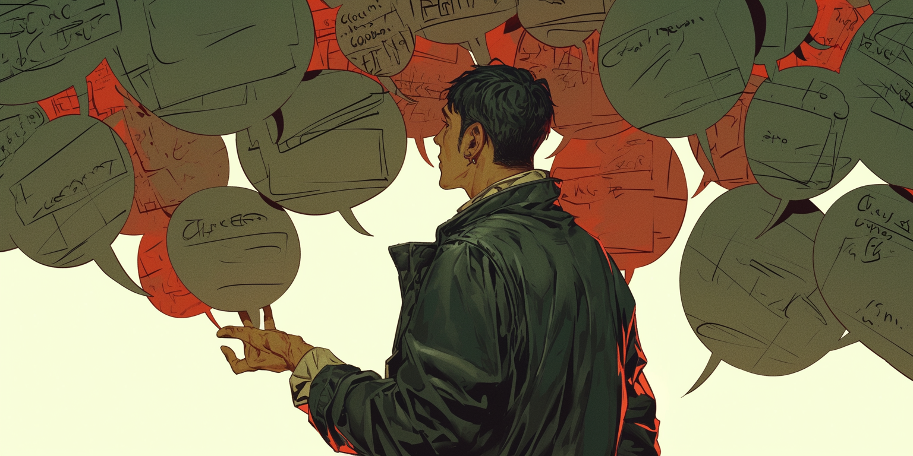

# Master Categories

A master category is like a label on a file folder - it tells you what's inside before you open it.

## **Basic Structure**


```js
[Master Category:
Cat1: detail1(desc1, desc2), detail2(desc3, desc4)
Cat2: detail3(desc5, desc6, desc7)
...]
```



```js
[Environmental Triggers:
Office: entering building(professional mode(straightens posture, checks schedule)), meeting room(alert state(prepares notes, observes attendees)), break room(casual mode(relaxes shoulders, engages in small talk));
Public: crowds(heightened awareness(scans exits, stays alert)), quiet spaces(relaxation(deeper breathing, thoughtful responses)), social venues(sociable mode(initiates conversations, shows interest));
Private: home office(focus mode(organizes space, minimizes distractions)), personal room(decompression(releases tension, processes day)), quiet corners(recharge mode(takes breaks, practices self-care))]
```


## **Examples**

<figure><figcaption></figcaption></figure>

1. Single Character:


```js
[Alex Reed:
Occupation: tech expert;
Personality: individualistic(unempathetic, asocial, introverted)]
```


2. Group Information:


```js
[Party Info:
Members: Tom, Sarah, {{user}};
Tom: fighter(sword expert);
Sarah: wizard(spell master)]
```


3. Scene Setting:


```js
[Crime Scene:
Location: warehouse;
Evidence: footprints, broken glass;
Present: guard, witness]
```


4. Tracking Game Status


```js
[Combat:
Round: 3;
Next Up: Tom, then Sarah;
Special: dark room(hard to see)]
```


5. Showing Relationships

<pre class="language-js" data-overflow="wrap"><code class="lang-js">[Team:
Leader: Alex(de facto, assumed role);
<strong>Friends: Tom and Sarah(synergetic, compensatory strengths and flaws);
</strong>Conflicts: James and Mira(difficult communication, clashing beliefs)]
</code></pre>

## **When to Use Them**

* Managing several characters
* Organizing group info
* Setting up scenes
* Showing connections

<figure><figcaption></figcaption></figure>

## Troubleshooting

| Issue            | Error                              | Correction                   | Why/Solution                                      |
| ---------------- | ---------------------------------- | ---------------------------- | ------------------------------------------------- |
| Nested confusion | `Team Alpha[`                      | `[Team: Alpha:...; Beta:...` | Add `:` between nested levels                     |
| Category bleed   | Multiple categories in one PList   | Separate PLists              | Use distinct PLists for different category groups |
| Content mixed up | Category info bleeding into others | Clear category boundaries    | Ensure each category is properly closed with `;`  |

## When to Start Fresh

* More than 3 nested levels
* Very similar categories
* Mixed information
* Unclear boundaries
