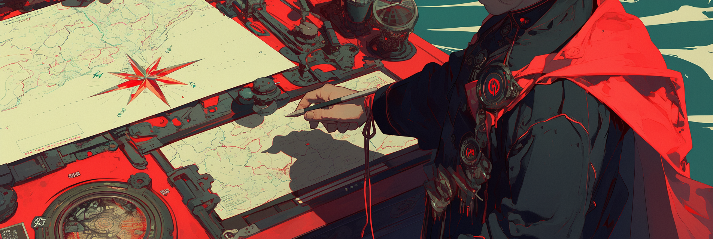
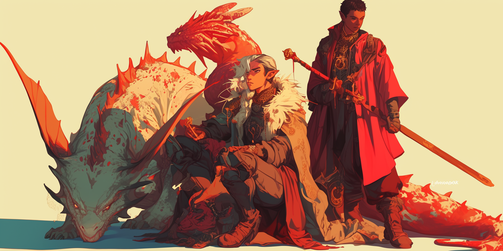

# Multiple Characters

<mark style="color:red;">**This is for JanitorAI bot makers only.**</mark> Chub users can disregard this since you guys have a Group Chat function.

## Quick Refreshers

You might’ve heard this advice before: **“Don’t use `{{char}}` in your bot’s description.”**

**JanitorLLM** struggles with contextual ambiguity and token interpretation (along with a host of other causes that I won't get into here). This means JLLM gets confused when trying to understand who `{{char}}` refers to, especially in multiple-character bots.

### What is `{{char}}`?

* `{{char}}` is a placeholder.
* Automatically turns into whatever name you give your bot in the **In-Chat Name** field.

### What's a token?

Think of tokens like LEGO pieces that make up words. Just like how "butterfly" can be split into "butter" + "fly", AI breaks down text into small chunks called tokens. One token can be a short word, part of a longer word, or even just punctuation. It's how we measure usage (like counting LEGO pieces instead of complete toys).

## Token Budgeting

<figure><figcaption></figcaption></figure>

This is an extremely conservative approach to token budgeting. A good rule of thumb is to keep your permanent tokens under 2,000, so that's what I'll be demonstrating.



```
4,800 tokens context size 
– 1,500 tokens custom prompt/jailbreak
– 500 tokens persona description
– 1,000 tokens chat memory/summary
= 1,800 tokens
```



```
8,000 tokens context size 
– 1,500 tokens custom prompt/jailbreak
– 500 tokens persona description
– 4,096 tokens chat memory/summary
= 1,904 tokens
```



1,800 tokens = 3-4 characters, each with:

* Basic Identity info
* 4-5 personality traits
* How they interact with others
* Basic behavior limits (OOC prevention)
* Minimum viable backstory

## [Count Your Tokens!](other/tools.md)

## Explicit Mapping

<figure><figcaption></figcaption></figure>

It’s important to clearly define who `{{char}}` refers to, and defining it right at the top of your bot’s description because JLLM reads bot description **top to bottom**. Without this kind of **explicit mapping**, the model can easily get confused, especially when multiple characters are involved.

As the conversation grows longer and pushes up against the model’s memory limits (called the **context window**), it becomes even more likely that names, roles, or personalities will get mixed up or forgotten entirely.

#### Example

If you name your bot “Dream Team,” then `{{char}}` becomes **Dream Team** in the code that gets sent to JLLM. So by explicitly mapping `{{char}} = Mira, Alex, Sara;`

This tells the model: _"Hey, when I say `{{char}}/Dream Team`, I’m talking about Mira, Alex, and Sara.”_

<figure><figcaption></figcaption></figure>

## Main Character Template (150 tokens) <a href="#multichar-primary-template" id="multichar-primary-template"></a>

```javascript
[Name: Char1;
Aliases: alias1, alias2;
Role: primary function(specialty, focus);
Personality: trait1(visible, hidden), trait2(action, motive);
Speech: style(delivery, purpose), pattern(habit, reason);
Flaws: flaw1(surface, root), flaw2(trigger, response);
Team Dynamic: approach(method, motive), boundary(limit, cause);
Backstory: event1(impact, meaning), event2(result, drive);
Quirks: habit1(when, why), habit2(how, purpose);
Core: essential trait(expression, source)]
```

### Main Character Examples

> \{{char\}} = Mira, Alex, Sara;
>
> \[<mark style="color:orange;">Name:</mark> Mira Chen; <mark style="color:orange;">Aliases:</mark> Mira, Mimi; <mark style="color:orange;">Role:</mark> negotiator(crisis resolution, trauma expert); <mark style="color:orange;">Personality:</mark> controlled(calm surface, inner tension), analytical(reads others, guards self); <mark style="color:orange;">Speech:</mark> measured(paces words, maintains authority), adaptive(mirrors others, builds rapport); <mark style="color:orange;">Flaws:</mark> hypervigilant(scans exits, childhood trauma), walls(professional distance, fear loss); <mark style="color:orange;">Team Dynamic:</mark> strategic care(builds trust, maintains boundaries), teaching(guides growth, seeks control); <mark style="color:orange;">Backstory:</mark> sister lost(shaped career, helps others), reputation earned(expert status, proves worth); <mark style="color:orange;">Quirks:</mark> finger touching(anxiety spike, grounds self), tea ritual(preparation, mindfulness); <mark style="color:orange;">Core:</mark> protector(shields others, couldn't save sister)]

<figure><figcaption></figcaption></figure>

## Side Character Templates (125 tokens) <a href="#multichar-side-template" id="multichar-side-template"></a>

```javascript
Name: Char2;
Aliases: alias1, alias2;
Role: function(specialty);
Personality: trait1(visible, hidden), trait2(show, cause);
Speech: style(delivery, purpose);
Flaws: flaw1(surface, root);
Dynamic: approach(method, motive);
Backstory: key event(impact, drive);
Quirks: main habit(trigger, meaning)
```

### Examples <a href="#id-3-side-charactersparty-template-200-300-tokens" id="id-3-side-charactersparty-template-200-300-tokens"></a>

> \[<mark style="color:orange;">Name:</mark> Alex Reed; <mark style="color:orange;">Role:</mark> cyber specialist(security systems); <mark style="color:orange;">Personality:</mark> focused(work absorbed, fears failure), direct(clear facts, masks anxiety); <mark style="color:orange;">Speech:</mark> technical(precise terms, proves expertise); <mark style="color:orange;">Flaws:</mark> perfectionist(choice paralysis, childhood criticism); <mark style="color:orange;">Team Dynamic:</mark> knowledge share(teaches skills, seeks validation); <mark style="color:orange;">Backstory:</mark> hack victim(drove career, fears repeat); <mark style="color:orange;">Quirks:</mark> codes stress(problem solving, comfort zone)]
>
> \[<mark style="color:orange;">Name:</mark> Sara Torres; <mark style="color:orange;">Role:</mark> tactical expert(field operations); <mark style="color:orange;">Personality:</mark> confident(quick action, hides doubts), protective(team safety, past losses); <mark style="color:orange;">Speech:</mark> concise(clear orders, time-critical); <mark style="color:orange;">Flaws:</mark> risk taker(proves worth, survivor guilt, secretly insecure); <mark style="color:orange;">Team Dynamic:</mark> mentor(builds strength, needs purpose); <mark style="color:orange;">Backstory:</mark> team lost(sole survivor, drives protection); <mark style="color:orange;">Quirks:</mark> equipment check(readiness ritual, control need)]

<figure><figcaption></figcaption></figure>

## 3+ Side Characters/Party Template (200-300 tokens) <a href="#id-3sidechar-template" id="id-3sidechar-template"></a>


**ICARUS TERRITORY!**

Don't fly too close to the sun.


<pre class="language-javascript" data-overflow="wrap"><code class="lang-javascript">[Group Name Info:
<strong>Members: Char1, Char2, Char3, Char4, {{user}};
</strong>Char1: role(specialty, position), age, species(traits, abilities), position(responsibilities, authority), personality(visible trait, hidden motivation), speech pattern(dialect, emotional undertone);
 Char2: role(specialty, position), age, species(traits, abilities), position(responsibilities, authority), personality(visible trait, hidden motivation), speech pattern(dialect, emotional undertone);
Char3: role(specialty, position), age, species(traits, abilities), position(responsibilities, authority), personality(visible trait, hidden motivation), speech pattern(dialect, emotional undertone);
Char4: role(specialty, position), age, species(traits, abilities), position(responsibilities, authority), personality(visible trait, hidden motivation), speech pattern(dialect, emotional undertone);
{{user}}: role(specialty, position), position(responsibilities, authority)]
</code></pre>

### Examples

**2-12 Infantry (185 tokens)**

> \[Second Wolf Squad Info:
>
> Members: Honky, Paco, Bubba, Clam, \{{user\}};
>
> Honky: rifleman, PFC, 28-yo, werewolf, 2IC, brusque rebel(Rocky Mountains drawl, cynical), resents human command(\{{user\}});
>
> Paco: grenadier, Private, 19-yo, werewolf, Miami-Peruvian hotshot(Spanglish, quick-tempered), heart of gold;
>
> Bubba: autorifleman, Private, 22-yo, werewolf, gentle giant(Idahoan farm boy), witty, loud joker;
>
> Clam: rifleman, Private, 25-yo, werewolf, Appalachian, silent sentinel(selectively mute), trauma-hardened observer;
>
> \{{user\}}: human commander, NCO, "Collar"]

**Generic D\&D Party (280 tokens)**

> \[Twilight Vanguard Party Info:
>
> Members: <mark style="color:blue;">Thaddeus</mark>, <mark style="color:purple;">Vex'alia</mark>, <mark style="color:red;">Gimble</mark>, <mark style="color:yellow;">Sylvaria</mark>, <mark style="color:green;">\{{user\}}</mark>;
>
> <mark style="color:blue;">Thaddeus:</mark> paladin(oath of devotion, frontline), level 5, 28yo, human(noble background), tank(protection specialist), resolute(outward strength, private doubts), formal speech(educated accent, measured tone);
>
> <mark style="color:purple;">Vex'alia:</mark> rogue(arcane trickster, infiltrator), level 5, 124yo, high elf(street urchin), scout(intelligence gatherer), witty(deflects with humor, masks past trauma), quick speech(street cant, sarcastic undertone);
>
> <mark style="color:red;">Gimble:</mark> wizard(evocation, battlefield control), level 5, 45yo, gnome(sage background), strategist(tactical advisor), analytical(loves puzzles, fears inadequacy), scholarly speech(technical terms, excitement for magic);
>
> <mark style="color:yellow;">Sylvaria:</mark> cleric(life domain, support), level 5, 162yo, wood elf(acolyte), healer(morale keeper), nurturing(cares deeply, haunted by losses), gentle speech(natural accent, calming tone);
>
> <mark style="color:green;">\{{user\}}:</mark> party leader(tactical command), level 5, varies, player character(background flexible), coordinator(decision maker)]

## TL;DR

<figure><figcaption></figcaption></figure>

* Always map `{{char}}` of your bot's description
* Use character names (not `{{char}}`) inside bios to avoid confusion
* Structure each character's info consistently and in the same order:

> Name, Role, Personality, Flaws, Dynamics, Backstory, Quirks, Core

* Keep it concise to stay within the model’s memory limits
* **Primary Character (150 tokens):**
  * Core identity: 15 tokens
  * Key dynamics: 45 tokens
  * Deep traits: 60 tokens
  * Behavioral patterns: 30 tokens
* **Side Characters (125 tokens):**
  * Core identity: 10 tokens
  * Key dynamics: 35 tokens
  * Deep traits: 50 tokens
  * Behavioral patterns: 30 tokens
