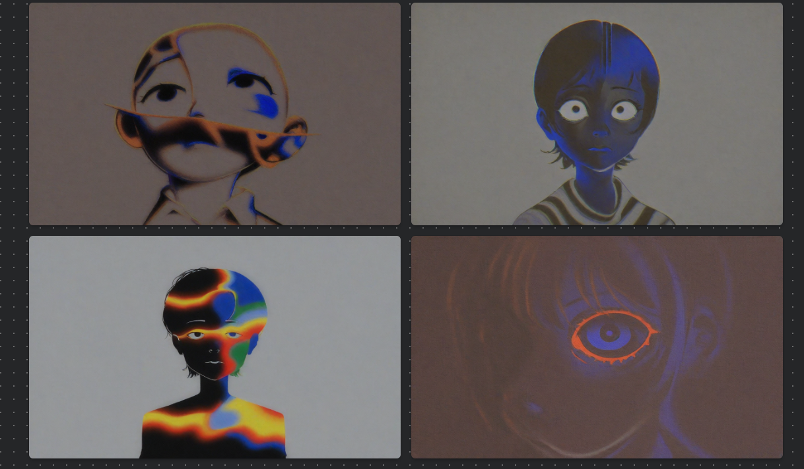

# Negative Prompts

<details>

<summary>Controlling Variables</summary>

* **Prompt:** 1boy, 1man, male, man
* **Model**: [NTRMix 3.5 (NTRMix-Illustrious-XL-Noob-XL)](https://civitai.com/models/926443?modelVersionId=1051221)
* **Sampling Steps**: 20
* **Sampling Method**: Euler a
* **CFG**: 4
* <mark style="color:red;">**Not Used:**</mark> <mark style="color:red;"></mark><mark style="color:red;">negative prompt, VAE, LoRA, Face Fix, Quality Tags</mark>

</details>

## Male-Focused

Most models often favor feminine features. Case in point:

<figure><figcaption><p>Before</p></figcaption></figure>

Use these descriptors for more consistently masculine character images:


```
1girl, 2girl, girl, female, feminine, woman, women, long hair, long neck, (pregnant), chibi, loli, (breasts, boobs)
```


Fixed results:

<figure><figcaption><p>After</p></figcaption></figure>

#### Recommendations:

* **Model**: [HomoSimile XL \[Pony, Illustrious, NoobAI\]](https://civitai.com/models/964011?modelVersionId=1319527)
* **LoRA**: [Niji6 Style-Mature Male- ill/Noob](https://civitai.com/models/1150038/niji6-style-mature-male-illnoob),&#x20;
* Increasing **Sampling Steps** from 20 to **25**
* Increasing **CFG** from 4 to **5** to get rid of the grayish, soft overlay look (sharper colors).

## Artistic Flaws

Case in point:

<figure><figcaption><p>Before</p></figcaption></figure>

Fixing it with this negative prompt:


```
blurry, blur, fuzzy, pixelated, jpeg artifacts, compression artifacts, watermark, text, signature, username, poorly drawn, bad anatomy, wrong anatomy, extra limbs, deformed, disfigured, mutated, distorted, twisted, warped, low quality, worst quality, amateur, newbie, cropped, frame cut, out of frame, head cut off
```


Fixed results:

<figure><figcaption><p>After</p></figcaption></figure>

#### Recommendations:

* Increasing **Sampling Steps** from 20 to **25**
* Increasing **CFG** from 4 to **5** to get rid of the grayish, soft overlay look (sharper colors).

## Composition Issues

Composition issues will look something like this:

<figure><figcaption><p>Before</p></figcaption></figure>

Fixing it with this negative prompt:


```
oversaturated, oversaturated colors, undersaturated, desaturated, overexposed, blown out, too bright, underexposed, too dark, high contrast, low contrast, noisy, grain, film grain, duplicate, duplicated, multiple, asymmetric, unbalanced, ugly composition, bad composition
```


Fixed results:

<figure><figcaption><p>After</p></figcaption></figure>

#### Recommendations:

* Increasing **Sampling Steps** from 20 to **25**
* Increasing **CFG** from 4 to **5** to get rid of the grayish, soft overlay look (sharper colors).

## Body/Face-Specific

Case in point:

<figure><figcaption><p>Before</p></figcaption></figure>

Fixing it with this negative prompt:


```
cross-eyed, crossed-eyes, lazy eyes, wonky eyes, deformed iris, deformed pupils, mutated hands, bad hands, extra fingers, missing fingers, fused fingers, bad feet, extra toes, missing toes, disproportioned, out of proportion, mutation, extra limbs, malformed limbs, bad proportions, anatomical nonsense
```


Fixed results:

<figure><figcaption><p>After</p></figcaption></figure>

#### Recommendations:

* Increasing **Sampling Steps** from 20 to **25**
* Increasing **CFG** from 4 to **5** to get rid of the grayish, soft overlay look (sharper colors).

## Common Unwanted Elements

* text, words, letters, numbers
* logo, watermark, signature
* frame, border, boundary
* background elements
* symbols, icons
* pattern, repeated pattern

## Style Prevention

* "I want photorealism."
  * cartoon, anime, manga, painting, sketch, drawing, flat colors, cell shaded
* "I want painterly style!"
  * photorealistic, realism, photography, hyper-realism
* "I want a traditional art look!"
  * 3d render, CGI, digital art (if traditional look wanted)
* "I don't want black & white images!"
  * black and white, monochrome, grayscale

## Technical Issues


```
rendering errors, clipping, z-fighting, broken perspective, bad shadows, incorrect shadows, inconsistent lighting, broken anatomy, floating limbs, disconnected limbs
```


## Tips for Usage

1. Combine related terms for stronger effect
2. Order from <mark style="color:orange;">**most to least important**</mark>
3. Use commas to separate terms
4. Consider adding [weights](group-1/page-1.md#weighting-syntax) to crucial terms (e.g., "bad hands: 1.5")
5. Test and adjust based on results
6. Keep context-specific unwanted elements in mind


## **TRIAL THROUGH FIRE (REPETITION)**

Negative prompts' effectiveness can vary between models and LoRAs. Experiment to find what works best for your specific use case.


\
<sub>© 2024 by SopakcoSauce. Except as otherwise noted, the content of this page is licensed under</sub> [<sub>CC BY-NC-SA 4.0</sub>](https://creativecommons.org/licenses/by-nc-sa/4.0/)&#x20;
