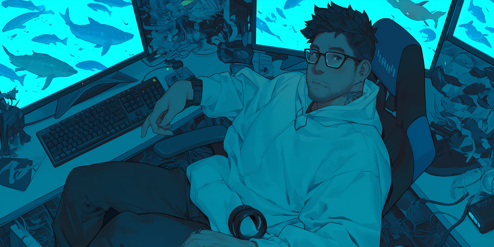

# Further Reading

## Chub Focused

### Bot Making

* [Master List of Botmaking Resources](https://rentry.co/botmaking)
* [StatuoTW's Guide to Making Bots](https://rentry.co/statuobotmakie)
* [Boner's Guide to Alichat](https://docs.google.com/document/d/1PmU7-MA25P41Q45yU0CpA66Jra51LI-WI1PwSXn2FMs/edit#heading=h.4xz85vf7qjy5)
* [StatuoTW's Guide to Genning AI Art](https://rentry.co/statuobotmakie#generating-ai-art-a-guide-to-your-first-ai-gens)
* [Unit1208's Guide to Stable Diffusion](https://rentry.co/g2q75dv2)

### Bot Chatting

* [StatuoTW's Guide - Anatomy of A Prompt, or What Is Sent to the AI when you hit Send](https://rentry.co/statuotwtips#the-anatomy-of-a-prompt)
* [Chub Discord Recommended Setting Presets](https://rentry.co/ChubDiscordPresets)
* [StatuoTW's Guide to Getting More Out of Your Bot Chats](https://rentry.co/statuotwtips)&#x20;
* [StatuoTW's Guide for Advanced Users: Generation Settings](https://rentry.co/statuotwtips#generation-settings-and-you)&#x20;
* [StatuoTW's Guide for Writing Your Own System Prompt](https://rentry.co/statuotwtips#the-system-prompt-how-to-write-your-own-and-why-you-may-want-to)&#x20;
* [StatuoTW's Guide for Making and Using a Persona](https://rentry.co/statuotwtips#making-a-persona-how-and-why-you-would-want-too)

### LLM

1. [StatuoTW's Guide to Using Local LLMs](https://rentry.org/StatuoLocalGuide)
2. [Mars vs Mercury by Kirandra](https://rentry.org/kiravenusguide)
3. [Free and Legal LLM Options](https://rentry.org/ParadoxsFreeLLMS)

<figure><figcaption></figcaption></figure>

## AI Image Generation Guides

* [Master List of Botmakin Resources - AI Image Generation Sites](https://rentry.co/botmaking#image-generation)&#x20;
* [SmileyTatsu's Guide to NAI](https://rentry.org/SmileyNAIArtists)&#x20;
* [StatuoTW's Guide to your First AI Gen's](https://rentry.co/statuobotmakie#generating-ai-art-a-guide-to-your-first-ai-gens)&#x20;
* [Unit1208's Guide to Stable Diffusion](https://rentry.co/g2q75dv2)
