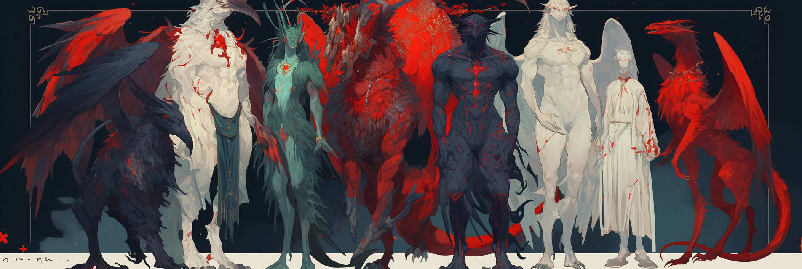
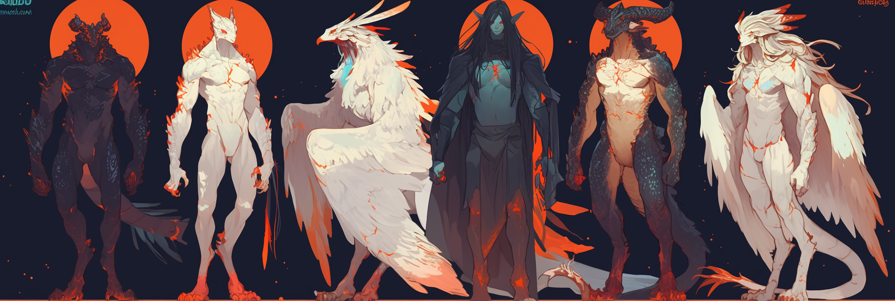

# Categories

Notes on All-Caps Category

It's the battle of `NAME: John` vs `Name: John`

**Pros of** `NAME: John`

* Makes important text stand out better
* Keeps formatting consistent
* Less chance of confusion with regular text
* Matches some computer formats like JSON keys and XML tags
* No real harm in how AI processes it

**Cons of** `NAME: John`

* Less natural for AI systems
* No real benefit in how AI processes it

**Bottom Line**

* Use `NAME: John` if you want people to read it easily.
* Use `Name: John` if you want people _**and**_ AI to read it easily.&#x20;

It's all personal preference. Pick whatever you like looking at the best.

## Human Characters

### SFW

* **Basic Info**: Name, Age, Gender, Ethnicity
* **Appearance**: Appearance, Hair, Eyes, Clothes
* **Personality**: Personality, Habits, Flaws, Quirks
* **Background**: Occupation, Hobbies, Likes, Dislikes

<figure><figcaption></figcaption></figure>

### NSFW

Certain models such as (but not limited to) JanitorLLM, CosmoRP, MN Dark Planet TITAN, and Hanami are extremely horny. Your bot will 100% try to fuck if you include NSFW information anywhere within the card/definition while using the models listed above.

If you enjoy slow-burn romance/clean RP, consider leaving these details out.

* Kinks
* Behavior During Sex
* Genitalia

<figure><figcaption></figcaption></figure>

### **Difference Between Kinks & Behavior During Sex**

| Kinks                                  | Behavior During Sex                   |
| -------------------------------------- | ------------------------------------- |
| Personal desires                       | Physical or emotional acts            |
| Often recurring preferences            | Can change with mood or partner       |
| BDSM, role-play, fetishes, etc...      | Kissing, specific positions, etc...   |
| Can have emotional or symbolic meaning | Usually more practical or spontaneous |

### **Genitalia (and secondary sexual characteristics)**

| AFAB                    | AMAB                       |
| ----------------------- | -------------------------- |
| Vulva, clitoris, vagina | Penis, scrotum             |
| Uterus, ovaries         | Prostate, seminal vesicles |
| Breasts                 | Facial hair                |
| Wider hips              | Broader shoulders          |
| Less body hair          | More body hair             |

## Non-Human Characters

When writing non-human character descriptions, be extremely detailed and specific. Assume the model has no prior knowledge and will default to human traits unless told otherwise in specific details. Remember that most models aren't trained on scales-and-tails data.

<figure><figcaption></figcaption></figure>

### Anatomy

<table><thead><tr><th valign="middle">Categories</th><th>Considerations</th></tr></thead><tbody><tr><td valign="middle">Skeleton &#x26; Limbs</td><td>digitigrade vs. plantigrade, number of limbs, wings, tails, extra joints, horns, tentacles, etc</td></tr><tr><td valign="middle">Hands &#x26; Feet</td><td>number of digits, claws vs. nails, dexterity level, prehensility of tail or tongue</td></tr><tr><td valign="middle">Skin, Scales, Fur &#x26; Feathers</td><td>texture, shedding, insulation, color patterns, iridescence, thermoregulation</td></tr><tr><td valign="middle">Face/Head Structure</td><td>snout length, ear placement, eye shape/number, absence of visible eyebrows, presence of crest/frills</td></tr><tr><td valign="middle">Internal Organs</td><td>lungs (gills? multiple?), hearts, venom sacs, scent glands, heat pits, etc</td></tr><tr><td valign="middle">Genitalia/Reproductive Traits</td><td>cloaca, hemipenises, number, location, retractability, heat cycles, egg-laying vs. live birth</td></tr><tr><td valign="middle">Voice/Vocal Range</td><td>hissing, growling, clicks, telepathy, inability to form certain phonemes</td></tr></tbody></table>

<figure><figcaption></figcaption></figure>

### Senses & Physiology

These directly affect how the character _perceives and reacts_ to the world.

| Categories | Considerations                                                                         |
| ---------- | -------------------------------------------------------------------------------------- |
| Vision     | night vision, heat vision, motion detection, color spectrum differences (UV, infrared) |
| Hearing    | frequency range, ear mobility, echolocation                                            |
| Smell      | scent tracking, pheromone detection                                                    |
| Touch      | sensitivity to vibration, textures, pain                                               |
| Taste      | dietary preferences, poison tolerance, cannibalism                                     |
| Scale      | size compared to humans (affects interaction physics)                                  |

<figure><figcaption></figcaption></figure>

### Movement & Combat Styles

Critical for scenes involving action or physicality.

| Categories         | Considerations                                                      |
| ------------------ | ------------------------------------------------------------------- |
| Gait               | slithering, flying, leaping, bounding, stalking                     |
| Flight/Climbing    | wing strength, flight endurance, surface grip                       |
| Defense Mechanisms | scales, venom, fire breath, camouflage, regeneration                |
| Fighting Style     | brute force, precision strikes, ambush predator, elemental affinity |

<figure><figcaption></figcaption></figure>

### Cultural & Psychological Traits

Avoid human defaulting by embedding non-human logic and ethics.

| Categories        | Considerations                                                                             |
| ----------------- | ------------------------------------------------------------------------------------------ |
| Society/Hierarchy | pack, horde, hive-mind, solitary, bloodlines                                               |
| Values/Taboos     | honor in hunting, ritual combat, mating displays, reverence for certain animals or seasons |
| Emotions          | expression style, suppression norms, physical signals of distress or arousal               |
| Language          | vocal or gestural, symbolic, scent-based communication                                     |
| Technology Level  | medieval, shamanistic, biotech, post-apocalyptic                                           |

<figure><figcaption></figcaption></figure>

### Magic, Abilities & Mutations

| Categories                   | Considerations                                    |
| ---------------------------- | ------------------------------------------------- |
| Elemental Alignment          | fire, ice, shadow, etc                            |
| Magical Biology              | innate spellcasting, mana glands, aura perception |
| Transformation/Shapeshifting | full or partial, limitations, triggers            |
| Psychic Abilities            | telepathy, mind-control, shared dreams            |

***

\
© 2024 by SopakcoSauce. Except as otherwise noted, the content of this page is licensed under [CC BY-NC-SA 4.0](https://creativecommons.org/licenses/by-nc-sa/4.0/)&#x20;
