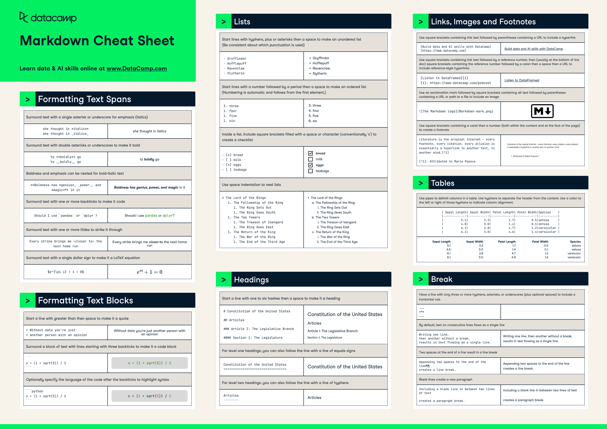

# Core Concepts

## Basic Rules

1. Put a space after colons
2. Don't put a space before semicolons
3. Put [descriptors](core-concepts.md#descriptors) in parentheses
4. Use commas between items in a list
5. **Skip the semicolon if it's the final item right before a `]`.**

## Delimiter Guide

<mark style="color:orange;">Orange text = optional fields.</mark>

<table data-full-width="false"><thead><tr><th width="154">Delimiter</th><th width="216">Format Rule</th><th>Purpose</th><th>Example</th></tr></thead><tbody><tr><td><code>[</code> and <code>]</code></td><td>Wrap entire PList; no line breaks between brackets and content</td><td>Contains all character information</td><td><code>[Name: John ... ]</code></td></tr><tr><td><code>:</code></td><td>Follow <a href="category-system.md">category name</a>, space after</td><td>Separates <a href="category-system.md">category name </a>from content</td><td><code>Name: John</code></td></tr><tr><td><code>;</code></td><td><p>End each category, no space before</p><p></p><p>Not needed if followed by a closing square bracket <code>]</code></p></td><td>Marks category end</td><td><code>[...Personality: kind(caring, gentle);</code><br><code>Hobbies: reading, writing]</code></td></tr><tr><td><code>(</code> and <code>)</code></td><td>No spaces after opening or before closing, can nest</td><td>Adds/Reinforce contextual and descriptive details</td><td><code>tall(6'2")</code>, <code>nervous(childhood trauma(bullying))</code></td></tr><tr><td><code>,</code></td><td>Space after; between items</td><td>Separates list items or traits</td><td><code>Hobbies: reading, writing, art;</code></td></tr><tr><td><mark style="color:orange;">Capitalization</mark></td><td><mark style="color:orange;">Optional for categories, just keep it consistent</mark></td><td><mark style="color:orange;">Aids identification</mark></td><td><mark style="color:orange;"><code>Name:</code>, <code>Age:</code>, <code>Personality:</code></mark></td></tr></tbody></table>

<figure><figcaption></figcaption></figure>


## Markdown & AliChat

Upon testing with various 7B Q6 locally hosted models, I've found a combination of Markdown & AliChat is a safe and comparable alternative to PList.&#x20;

**Markdown**

* Easy updates
* Logical grouping
* Clear relationship mapping

**AliChat**

* Clear, structured details
* Consistent formatting
* Token efficiency

### Markdown Basic Rules

* End each category with a line break (`\n`) instead of a semicolon (`;`)
* Use `#` headings to organize sections. They’re clearer and less likely to cause errors than square brackets (`[]`)

### [Markdown Cheat Sheet](https://www.markdownguide.org/cheat-sheet/)

<figure><figcaption><p>Source: <a href="https://www.datacamp.com/cheat-sheet/markdown-cheat-sheet-23">https://www.datacamp.com/cheat-sheet/markdown-cheat-sheet-23</a></p></figcaption></figure>

### Markdown Templates




```markdown
- Name: 
- Aliases: 
- Sex: 
- Gender: 
- Age: 
- Nationality: 
- Ethnicity: 
- Species: 
- Appearance: 
- Hair: 
- Eyes: 
- Facial Features: 
- Clothes: 
- Accent: 
- Speech: 
- Personality: 
- Dynamic With {{user}}: 
- Quirks/Habits: 
- Mannerisms: 
- Occupation: 
- Relationships: 
- Backstory: 
- Likes: 
- Dislikes:
- Hobbies: 
- Kinks: 
- Behavior During Sex: 
- Penis Description: 
- Balls Description: 
- Nipples Description: 
- Breasts Description: 
- Vagina Description: 
- Anus Description: 
- Other: 
```





```markdown
# World Info
- Era: time period(specific year/era, cultural context)
- Location: place name(region, country, specific details)
- Setting: genre(subgenre, tone), world type(hidden/open supernatural, technology level)
- Factions: group1(details), group2(details), group3(details)
- Conflicts: primary conflict(details), secondary conflicts(causes, effects)
- Society: structure(hierarchy, classes), customs(traditions, taboos)
# Lore
- Species: Supernatural/space aliens/incomprehensible horror/etc
- Abilities: primary powers(limitations, requirements), secondary abilities(specifics)
- Physiology: physical traits(details), biological needs(requirements)
- Weaknesses: fatal(specific conditions), non-fatal(limitations)
- Culture: traditions(practices), social structure(hierarchies)
- Rules: restrictions(consequences), requirements(enforcement)
- Stigma: social status(prejudices, limitations)
# Context
- History: key events(timeline, impact)
- Secrets: hidden elements(implications, who knows)
```



