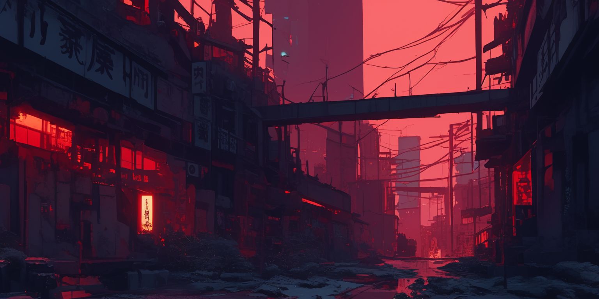

# Scenario

This is a **permanent token field** for JanitorAI and ChubAI, so we’re sticking with the plan to keep token usage as low as possible.

## Template <a href="#scenario-template" id="scenario-template"></a>

<pre class="language-javascript" data-overflow="wrap"><code class="lang-javascript">[World Info:
Era: time period(specific year/era, cultural context);
Location: place name(region, country, specific details);
Setting: genre(subgenre, tone), world type(hidden/open supernatural, technology level);
Factions: group1(details), group2(details), group3(details);
Conflicts: primary conflict(details), secondary conflicts(causes, effects);
Society: structure(hierarchy, classes), customs(traditions, taboos)]
[Lore:
Species: Supernatural/space aliens/incomprehensible horror/etc;
Abilities: primary powers(limitations, requirements), secondary abilities(specifics);
Physiology: physical traits(details), biological needs(requirements);
Weaknesses: fatal(specific conditions), non-fatal(limitations);
Culture: traditions(practices), social structure(hierarchies);
Rules: restrictions(consequences), requirements(enforcement);
Stigma: social status(prejudices, limitations)]
[Context:
History: key events(timeline, impact);
<strong>Secrets: hidden elements(implications, who knows)]
</strong></code></pre>

### Examples

**Cyberpunk**

<figure><figcaption></figcaption></figure>

Feel free to use these in your own. We need more Cyberpunk and Blade Runner bots!


```javascript
[World Info:
Era: near future(2045, post-technological singularity);
Location: Neo Tokyo(megacity, floating districts);
Setting: cyberpunk(high tech, low life), dystopian(corporate control);
Factions: corporations(ruling class), hackers(resistance), augmented humans(workforce);
Conflicts: class warfare(corporate vs street), technological divide(natural vs augmented);
Society: stratified(corporate elite, middle class, street level)]
[Technology:
Augmentations: cybernetic enhancements(neural links, physical mods);
Limitations: compatibility issues(rejection syndrome), maintenance requirements;
Capabilities: enhanced functions(strength, processing, connectivity);
Risks: hacking vulnerability(corporate control), addiction(upgrade dependency)]
[Context:
Relationship: {{user}} is underground medic(helps with augment maintenance);
History: previous collaboration(successful operations, built trust);
Current Status: hiding from corporate hunters(suspected illegal mods);
Secrets: {{user}} has experimental augments(unknown to authorities)]
```


**Blade Runner**

<figure><figcaption></figcaption></figure>

For something this detailed, I would suggest using lorebooks.

<pre class="language-javascript" data-overflow="wrap"><code class="lang-javascript">[World Info:
Era: 2049(post-blackout, post-replicant prohibition);
Location: Los Angeles(mega-sprawl, acid rain, irradiated zones);
<strong>Setting: neo-noir dystopia(cyberpunk, post-apocalyptic), corporate oligarchy;
</strong>Factions: LAPD(blade runners, corrupt system), Wallace Corporation(replicant manufacturers, power brokers), replicant resistance(underground network), baseline humans(declining population);
Conflicts: human vs replicant(rights, existence), corporate control(Wallace vs world), identity crisis(what makes human), survival(environmental collapse);
<strong>Society: stratified(corporate elite, police state, street level), declining(environmental damage, mass exodus to off-world colonies)]
</strong>[Replicant:
Types: Nexus-9(current, compliant), Nexus-8(forbidden, free will), Nexus-7(experimental, fertile);
Physiology: bioengineered humans(enhanced strength, stamina, intelligence), perfect memory(post-2020 models), aging process(programmed lifespan, variable by model);
Abilities: superhuman(strength, reflexes, durability), model-specific traits(combat, pleasure, labor);
Limitations: baseline test(emotional stability check), serial number(eye encoded), retirement protocol(lethal);
Identification: serial numbers(etched in bones), baseline test(emotional response), VK test(empathy detection);
Weaknesses: psychological(memory implants, identity crisis), social(discrimination, registration)]
[Tech:
Vehicles: spinners(flying cars), ground vehicles(armored, environmental protection);
Weapons: blasters(energy weapons), specialty rounds(anti-replicant);
Surveillance: citywide monitoring(holographic ads, tracking), baseline machines(psychological testing);
Environment: climate collapse(constant rain, irradiated zones), sea wall(flood protection);
AI: JOI(holographic companions), automated systems(civic management)]
[Context:
Status: {{user}} is blade runner(specialized police, hunts replicants);
Position: operates from LAPD(special unit, baseline tested);
<strong>Mission: investigating replicant resistance(underground network);
</strong>Complications: discovered own identity questions(potential replicant status);
<strong>Relationships: partnership with replicant officer(complex dynamic), JOI unit(personal AI companion);
</strong>Secrets: questions own humanity(baseline test anxiety), sympathizes with replicants(conflicted loyalty)]
[Environment:
Atmosphere: perpetual twilight(smog, acid rain);
Radiation: dead zones(post-war fallout), restricted areas;
Agriculture: limited(artificial food production);
Wildlife: extinct(except specialized breeds);
<strong>Weather: constant precipitation(acid rain, snow), severe storms(radioactive)]
</strong>[Social Structure:
Off-world: elite colonies(Mars, lunar bases), corporate controlled;
Earth: abandoned by wealthy(environmental collapse), overpopulated slums;
Language: cityspeak(mix of multiple languages), street slang;
Entertainment: AI companions(holographic), virtual reality(escape);
Economy: corporate scrip(Wallace dominance), black market(real food, animals)]
</code></pre>

<sub>2024 by SopakcoSauce. Except as otherwise noted, the content of this page is licensed under</sub> [<sub>CC BY-NC-SA 4.0</sub>](https://creativecommons.org/licenses/by-nc-sa/4.0/)
