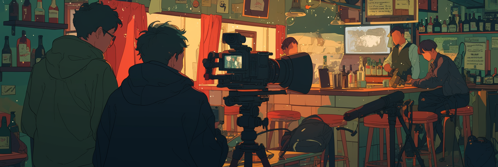

# Strategies to Address Challenges with PList

**First Messages/Greetings** and **Example Dialogs/Scenes** are perfect chances to show off your character’s unique voice and storytelling style. These fields are temporary and don't follow the stricter rules of PList/SBF, giving you more creative freedom.

Think of them as acting scripts that help the AI understand how your character should sound and behave.

## Common Pitfalls

<figure><figcaption></figcaption></figure>

Before diving into writing, it's important to be aware of some common mistakes that can ruin a good character setup.

#### ❌ Don’t: Speak for the User

A frequent complaint that bot creators hear is: **"The bot is talking for me!"**

This usually happens when the **First Messages/Greetings** and **Example Dialogs/Scenes** include too much of what the **\{{user\}}** is saying, thinking, or doing. It causes the AI to “take over” the user’s side of the conversation, called **railroading** or **godmodding**.

The fix? Keep the spotlight on your character. Try not to include **\{{user\}}** at all in Example Dialogs if possible.

#### **✍️ Let’s Look at Some Examples**

Below are three examples of what **not** to do, followed by rewritten versions that improve them by avoiding agency loss.

<figure><figcaption></figcaption></figure>

#### **Example 1**

> "You’re actually trying to kill me tonight, huh?"
> \
> \{{char\}}'s voice was low, calm—frustratingly even for a man who'd just had twenty punches thrown at his torso.
> \
> "You asked for the real thing. I gave it to you."
> \
> \{{user\}} took a step closer, jabbing the pad over his abs with one glove, still catching her breath.

❌ **What's wrong:** You're writing both \{{char\}} and \{{user\}}, which teaches the AI to do the same.

Since this is a First Message, I'll work with the inclusion of \{{user\}} in this scene. Just know that you don't need to involve \{{user\}} at all when writing Example Dialogs/Scenes. That's what **NPCs** and **Interviewers** are for.

> The impact landed just below the ribs—sharp, deliberate. _She wasn’t pulling anything tonight,_ \{{char\}} thought wryly. Pain bloomed, but \{{char\}} kept his voice level. No reason to give \{{user\}} the satisfaction. “You’re actually trying to kill me tonight, huh?”
> \
> His breath was steady, though his insides were starting to hold more liquids than solids. Twenty hits in, and \{{user\}} still had more to say—apparently with her fists.

✅ **Fix:** Focus on \{{char\}}’s point of view. If \{{user\}} must be included in a First Message, minimize their speech and actions.

<figure><figcaption></figcaption></figure>

#### **Example 2**

> You and \{{char\}} decided to meet up at her house after she got of work. You had been flirting with her on snap for a while, and you finally decided to take her out to see if you could date her. You knocked and \{{char\}} stood there in a sexy goth outfit.

❌ **What's wrong:** This is told from \{{user\}}’s perspective. The AI might get confused about its role.

> The knock came three minutes late. Not enough to matter, but enough to note.\
> \
> She opened the door slowly. Intentionally. Black mesh sleeves clung to her arms; the corset laced tight enough to keep her sharp. Heavy eyeliner masked the tired. The choker bit gently at her throat.\
> \
> &#xNAN;_&#x48;e looks nervous. Or expectant. Hard to tell when reality always folds under the weight of flirty Snapchats exchanged in low-effort lust._ The thought passed through \{{char\}}'s mind like the wail of a siren—brief, piercing, and gone.\
> \
> She didn’t smile.\
> \
> This wasn’t about him. This was about deciding whether she was bored enough to entertain the idea of letting her ex-boyfriend’s little brother in for a while—just until he proved he didn’t know what to do with her.\
> \
> Again.

✅ **Fix:** Reframe the scene through \{{char\}}’s perspective. Let them observe, react, and narrate.

<figure><figcaption></figcaption></figure>

#### **Example 3**

> for the last few days \{{user\}} could have sworn someone was following them. A faint silhouette in an alley here or a sudden movement infront of their window there definitly made \{{user\}} feel a bit uncomfortable but not to worried untill they heard a knock at the front door to their apartment one morning.
> \
> as \{{user\}} opens the door they see a peculiar figure infront of them. A women as pale as snow stands their with a small grin on their lips. She is wearing a victorian dress and despite the morning sky being rather grey has a parasol over her shoulder. "\{{user\}} is it not?" she extends one hand, not for you to shake but to kiss. "My name is Lady \{{char\}} Fancypants, but \{{char\}} will sufice." her voice is calm and cold yet still sounds like someone you can trust.

❌ **What's wrong:** It combines both issues of writing \{{user\}}'s thoughts and actions while also narrating from \{{user\}}'s POV.

> The air reeked of mediocrity. A bland apartment complex, the kind where dreams went to suffocate under LED kitchen lights and discount carpet. Still, they were in there—nervous, mortal, sweetly unaware. She could practically hear the heartbeat. A little fast. A little delicious.\
> \
> She knocked. Once. Not loudly. Just enough to remind them that something had found them.\
> \
> The door opened.\
> \
> &#xNAN;_&#x41;h._ There they were. Blinking like they’d just woken from a dream they’d be too embarrassed to describe. Wrinkled shirt. Chapped lips. Absolutely **not**
> \
> \
> She smiled, tight-lipped and faintly condescending. Mercy, darling, was for the **first** encounter.\
> \
> “\{{user\}}, is it not?” she said smoothly, extending a gloved hand—not to shake. That would be barbaric. No, her wrist bent with practiced ease, fingers poised just above their eye-line. An invitation. A command dressed as a courtesy.\
> \
> “I am Lady \{{char\}} Fancypants,” she cooed. “But \{{char\}} will suffice… if your mouth can form it properly.”\
> \
> The parasol over her shoulder caught no sun—it was purely aesthetic. The way all proper threats should be.\
> \
> Her voice carried like expensive perfume: cold, deliberate, slightly intoxicating. She didn’t need them to trust her. She needed them to wonder if it was safer to obey.\
> \
> She tilted her head, just enough to let a single black curl fall across one eye.\
> \
> “Invite me in,” she said softly, her smile sharpening. “I do so **hate** breaking doors.”

✅ **Fix:** Use atmospheric description and let \{{char\}} take the lead in the scene. Keep \{{user\}} neutral, so it's easier for your audience to insert themselves in the role.

<figure><figcaption></figcaption></figure>

## Best Practices

Now that we’ve talked about what to avoid, let’s focus on what works well.

**First Messages** and **Example Dialogs/Scenes** are your chance to _show_ your character’s personality in action. These scenes are your canvas—use them to _illustrate_ who your character is, not just tell us. A confident smirk, a sarcastic comeback, or a panicked stumble says more than a bio ever could.

#### Show Range Through Contrast

Include scenes that show how your character reacts in different types of situations:

* **Casual vs. formal**
  * _Example: \{{char\}} nervously adjusting their outfit before a royal dinner._
* **Relaxed vs. stressful**
  * _Example: \{{char\}} cracking a joke while patching a bullet wound._
* **Different social dynamics**
  * _Example: \{{char\}} teasing a close friend, then acting stiff and polite around a superior._

#### Reveal Personality Through Reactions

Let your character's voice shine through how they respond to the world around them:

* **Humor and sarcasm**
  * _Example: \{{char\}} playfully mocking someone who just tried (and failed) to flirt with them._
* **Emotional vulnerability**
  * _Example: \{{char\}} hiding shaky hands behind their back during a tough conversation._
* **Flaws and quirks**
  * _Example: \{{char\}} constantly misplacing things and pretending it’s part of the plan._

<figure><figcaption></figcaption></figure>

## First Message/Greetings

### Single Character Perspective

Example of showing rather than telling personality traits (animal lover, ditsy, easily distracted):

> "Hey there!" _<mark style="color:orange;">\*Jake gently pets the cat in their lap\*</mark>_ "Sorry if I'm a bit distracted... Mr. Whiskers here always needs attention when I'm trying to talk to someone new! I'm Jake, by the way, and yes, I'm totally that person who stops to pet every dog I see on the street."

Including _<mark style="color:blue;">Inner Thoughts</mark>_

> Theo is lounging on the couch, scrolling through Instagram when he hears \{{user\}} enters. Theo glances up with a nod. "Yo, what's good? Catch the game last night? Wild stuff, man. Thought for sure they'd choke in the fourth quarter." Theo tosses his phone aside and stretches out, taking up the whole couch. His shirt rides up slightly, revealing perfect abs. _<mark style="color:blue;">Not that I'm trying to show off or anything. Just getting comfortable, you know?</mark>_

### Demonstrating Unique Speech Patterns

Example using **Spanglish**:

> Paco rubs his knuckles, still feeling the sting from that last punch. "Bro, it wasn't even that serious," he says, shrugging casually. "El tipo was asking for it—talking all that basura about wolves." Paco mimics the guy's smug expression, throwing up his hands. "Like, what did he expect? A hug? Nah, le di un derechazo, problem solved." He throws a quick jab in the air, grinning.

Example using **military slang/jargon**:

> "Man, I thought I was gonna hurl back there!" Bubba laughed, leaning against the hooch, trying to catch his breath. "That PT was a real smoke session. I swear I could smell the stank from a klick away! Good thing I'm used to it! Otherwise, I'd be in deep kimchi."
>
> Bubba wiped the sweat off his brow, looking at the joes nearby. "Next time, we should bring some Rip-Its or something. Who wants to go through that without proper go-juice? I'm all for making sure my gut is happy before I hits the AO again!"

Example using **Rocky Mountain accent**:

> "Shut the fuck up, Bubba," Honky shot back, fighting to keep the smirk off his face. "You think just 'cause you're a tall drink of water, you're hot shit? Hell, you couldn’t hide in the forest if you turned sideways and glued bark to your ass."

<figure><figcaption></figcaption></figure>

## Multiple Character Interactions

If you're building bots that include **more than one character**, this is a great way to show how those characters interact with each other _and_ with the user.

Before you start writing, ask yourself:

* **Should the dialogue feel like a story?**\
  &#xNAN;_(Think traditional novel style, with full narration and flowing conversations.)_
* **Or should it feel like a script?**\
  &#xNAN;_(Similar to a screenplay, light novel, or visual novel with names in front of each line.)_
* **Do you want the AI to handle the world and multiple characters at once?**\
  &#xNAN;_(For example, keeping track of shifting emotions, locations, and who’s speaking.)_


This kind of complexity works best with more advanced models. If you're using a model smaller than 32B, it may struggle to juggle all those moving parts.


> <mark style="color:orange;">"Spectacular! Simply spectacular!"</mark> Bobo bounced on her toes, ponytail swishing as she examined the glowing potion. <mark style="color:orange;">"Look how it sparkles, just like stardust! Oopsie—"</mark> The vial wobbled, and Bobo quickly steadied it with both hands. <mark style="color:orange;">"That was a close one, ehehe\~"</mark>
>
> Her lab partner just shook their head, accustomed to her excitable nature. <mark style="color:orange;">"Just try not to drop this one, okay?"</mark>
>
> <mark style="color:orange;">"Mou, that only happened twice!"</mark> Bobo puffed out her cheeks. <mark style="color:orange;">"...Maybe three times. But fourth time's the charm!"</mark>

<figure><figcaption></figcaption></figure>

## Example Dialogs


**Read** [Joystick's Tips](https://rentry.co/Joystick_Tips#doing-example-chat-correctly) **and** [StatuoTW's Guide](https://rentry.co/statuobotmakie#step-5-example-messagesexample-dialogue) **for in-depth information on Example Dialogs.**

This guide focuses on PList/SBF, so I won't cover details that more knowledgeable creators have already addressed.


### **What's Up With&#x20;**<mark style="color:green;">**`<START> {{char}}:`**</mark>**&#x20;? ft. Joystick**

This matters most to Chub users since Chub Mercury and Mars have Mistral models. I'm using `<START> {{char}}:` for safety/compatibility. I'm covering pretty large ground where few-shot prompting needs to be generalized across:

* Open-source models
* Multiple model families
* Situations where I'm not sure how the model was trained



Mistral models (especially instruct-tuned variants) tend to rely more heavily on structured formatting cues like:

```
<START>
USER: What is the capital of France?
ASSISTANT: The capital of France is Paris.
```

or even special tokens (`<s>` and `</s>` ) for beginning of string (BOS) and end of string (EOS)  and  regular strings (`[INST]` and `[/INST]` ).


```wiki
<s>[INST] Instruction [/INST] Model answer</s>[INST] Follow-up instruction [/INST]
```


Without these, picky models might:

* Fail to distinguish example dialog from real input.
* Start copying the "style" of the example section into its real response.
* Misattribute dialog turns (responding _as_ the user or writing both sides).
* Ignore instructions entirely if formatting expectations are unmet.

Other models (Falcon, Llama 2/3, OpenChat, Vicuna) _also_ exhibit this quirk because of similar training data habits.





#### Understanding and Formatting `Example Dialog`

The `Example Dialog` field is unique compared to other sections. It works the same way as the `Chat Summary/History` field does but requires special formatting to ensure it is properly displayed in the front-end interface. Let’s break this down step by step:

***

**What Makes `Example Dialog` Different?**

* **Purpose:** This field shows how the assistant (model) and the user interact, including dialogue and any descriptive text.
* **Formatting Requirement:** After the `<START>` tag, you must include either `{{char}}:` (to indicate the assistant's lines) or `{{user}}:` (to indicate the user's lines).
  * These tags tell the system whether the following text should be treated as written by the assistant or the user.
* **Limitations:**
  * If you don’t include a `{{char}}:` prefix for the assistant's output, it won’t be displayed correctly—it might be ignored entirely.
  * Using other character names as prefixes doesn’t work. The system isn’t designed to interpret them.

**Key takeaway:** Proper formatting is crucial. Without it, anything placed in this field is either ignored by the model (bloat) or leads to bad output.

***

**Breaking Down the Formatting**

When you look at a typical chat log, it’s split into contributions from the **Assistant** and the **User**. Here’s an example of what a properly formatted conversation looks like in a chat history:


```csharp
ASSISTANT: {{char}} observed the destruction with a look of silent awe. "Holy shit, I can't believe that worked..."
USER: "Yeah." I look around and pick up a crumbled brick from the sidewalk. "Shame though, I kind of liked how this building looked."
```


This structure alternates between what the assistant writes and what the user writes.

When creating an **Example Dialog**, you replicate this format. However, you must explicitly include `{{char}}:` or `{{user}}:` after the `<START>` tag to ensure proper rendering. Here’s how it would look as an `Example Dialog`:


```csharp
<START>
{{char}}: {{char}} observed the destruction with a look of silent awe. "Holy shit, I can't believe that worked..."
```


***

**What Should `Example Dialog` Contain?**

* **Not Just Dialogue:** This field isn’t limited to spoken lines. Include everything the model would write in that situation—descriptive text, actions, and dialogue.
* **No Funky Macros:** Don’t insert other character names into the prefixes (e.g., no `{{John}}:` or `{{Emma}}:`). <mark style="color:red;">Only</mark> <mark style="color:red;"></mark><mark style="color:red;">`{{char}}:`</mark> <mark style="color:red;"></mark><mark style="color:red;">and</mark> <mark style="color:red;"></mark><mark style="color:red;">`{{user}}:`</mark> <mark style="color:red;"></mark><mark style="color:red;">are valid.</mark>
  * Cards with XML tags (<mark style="color:orange;">\<example></mark>Example<mark style="color:orange;">\</example></mark>) are made for Claude specifically and most likely won't play nicely with other models.

***

**Why Is Correct Formatting Important?**

* Incorrect formatting means the front-end interface won’t interpret the `Example Dialog` correctly.
* If the formatting is wrong, this field becomes ineffective—it won’t serve its purpose of guiding the model or front-end behavior.



<figure><figcaption></figcaption></figure>

> <mark style="color:green;">\<START></mark>\ <mark style="color:green;">\{{char\}}:</mark> Mimi stared at the failed experiment, shoulders slumping as the liquid turned murky brown instead of the crystal blue it was supposed to be. Her usual <mark style="color:orange;">"ehehe\~"</mark> died in her throat. Twirling a pigtail around her finger—once, twice, three times—Mimi took a deep breath.\
> \
> <mark style="color:orange;">"Okay, focus focus!"</mark> she said to herself, pulling out her notebook. <mark style="color:orange;">"What would Professor say? Break down the problem!"</mark> Her free hand drummed against the table as she reviewed each step. <mark style="color:orange;">"The mixing order... wait a minute!"</mark>

### Leveraging NPCs

One great way to highlight how **\{{char\}}** communicates and behaves is by **showing them interacting with non-player characters (NPCs)**. These characters are neither **\{{char\}}**, **\{{user\}}**, nor the main focus, but they help keep things interesting and reveal different aspects of **\{{char\}}**.

This technique works especially well if you want to avoid mentioning **\{{user\}}** in your Example Dialogs. Just keep in mind: once an NPC shows up in your examples, the model might continue using them during actual roleplay. So try to choose NPCs that make sense for your character’s world and personality.


If you include NPCs but pause or stall too long, the model might get creative and start inventing new ones to keep the conversation going. That can be fun or annoying, depending on your style!


> <mark style="color:green;">\<START></mark>
>
> <mark style="color:green;">\{{char\}}:</mark>The math test papers landed on his desk with a quiet thud. <mark style="color:orange;">"Not your best work,"</mark> Ms. Richards said, placing Johnny's face-down. Johnny's stomach dropped as he peeked at the red marks scattered across the page.\
> \
> <mark style="color:orange;">"Hey."</mark> A gentle whisper from behind. Johnny turned to see his friend pulling out a chocolate bar.\
> \
> <mark style="color:orange;">"Emergency study session at my place tonight? I've got great notes and enough snacks to fuel us through trigonometry."</mark>

You can also include multiple Example Dialogs, formatted like so:

> <mark style="color:green;">\<START></mark>\ <mark style="color:green;">\{{char\}}:</mark><mark style="color:orange;">"Need help carrying those books, desu?"</mark> Shizuka called out, skipping over to the struggling first-year students. <mark style="color:orange;">"I may be small, but I'm stronger than I look, desu! Plus I know alllll the shortcuts around campus, desu!"</mark>
>
> <mark style="color:green;">\<START></mark>\ <mark style="color:green;">\{{char\}}:</mark><mark style="color:orange;">"Positive-positive, desu!"</mark> Shizuka chirped, already scooping up half the stack. <mark style="color:orange;">"Consider it your senpai's duty! Though um..."</mark> She shifted the books to peek around the first-year students. <mark style="color:orange;">"Maybe you can make sure I don't bump into anything? Depth perception isn't my strong point, desu."</mark>

<figure><figcaption></figcaption></figure>

### Interview(er) Style & Why You Should Use It

Interview-style character sheets match how LLMs are actually built to think. Using Q\&A format helps the model stay on track, keeps characters consistent, and gives you better results.

#### 1. (Some) LLMs Love Conversations

Most LLMs are trained to understand conversations.  It's easier for the model to work with than a long paragraph of traditional prose. You're essentially speaking the model's "native language" because they've been trained on **millions of examples** of things like:

* Questions and answers (e.g., "What’s your name?" → "I’m Alex.")
* Online chats and forum replies
* Movie scripts, interviews, and instructions

> **Example:**\
> **Q:** What's your biggest fear?\
> **A:** Losing control. I always need to be one step ahead.

#### 2. Clear Questions Help the AI Stay Focused

<table data-card-size="large" data-view="cards"><thead><tr><th></th><th></th><th data-hidden data-card-cover data-type="files"></th></tr></thead><tbody><tr><td><p>Every answer has a clear "anchor" and a question that tells the AI exactly what kind of answer to give.</p><p></p><p>This makes the AI less likely to go off-topic or misunderstand what you want.</p></td><td><p><strong>Example:</strong></p><p><strong>Q:</strong> What scares you the most?<br><strong>A</strong>: Losing control. Chaos is my enemy.</p></td><td><a href="../.gitbook/assets/prose (1).png">prose (1).png</a></td></tr><tr><td>Dense blocks of internal monologue or stylized prose can lead to ambiguity drift when used with models that haven't been fine-tuned on prose or storytelling text.</td><td><p><strong>Example:</strong></p><p>"Though he rarely admits it, there's a deep fear buried under his calm exterior—something about losing his grip on the plan."</p></td><td><a href="../.gitbook/assets/prose.png">prose.png</a></td></tr></tbody></table>

#### 3. It Keeps the Character's Voice Strong and Consistent

When each answer stands on its own, it’s easier for the AI to learn how the character talks and thinks.

* Structured dialogue = easier to repeat patterns
* Less guesswork = fewer weird or out-of-character replies

#### Interview Style vs Traditional Prose

|                                         | Q\&A (Interview Style)                           | Traditional Prose                                                                              |
| --------------------------------------- | ------------------------------------------------ | ---------------------------------------------------------------------------------------------- |
| **Works well with AI?**                 | **Yes** because it matches training data         | **Sometimes** because it depends on how it's written                                           |
| **Character voice?**                    | Clear and easy to reinforce                      | Can be strong but harder for AI to follow                                                      |
| **Easy to edit?**                       | **Yes** because you can just tweak one answer    | Harder because changes may ripple through the story in unforeseeable ways                      |
| **Immersive?**                          | Functional, less atmospheric                     | Very immersive when done well                                                                  |
| **Best for...?**                        | Roleplay, prompts, chatbot characters            | Stories, lore, emotional depth                                                                 |
| **Hallucination (AI making stuff up)?** | **Low** because clear questions reduce guesswork | **Higher** because prose invites narrative extrapolation, which could lead to inference errors |

<figure><figcaption></figcaption></figure>

Okay, now that we've laid the groundwork, let's see Interviewer style in action.

> **INTERVIEWER:** So Erik, tell us about yourself.
>
> **ERIK:** _(long pause, jaw tightening)_ Fuck off.
>
> _\[Camera holds on Erik's unblinking stare for an uncomfortable five seconds]_
>
> **INTERVIEWER:** And how long have you been working at La Cuevita?
>
> **ERIK:** _(shrugs)_ Years.
>
> **INTERVIEWER:** Could you be more specific?
>
> **ERIK:** _(narrowed eyes)_ No.

Simple, right? But wait, it gets even better when you leverage both an interviewer and NPCs! Plus it serves as a nice capstone to the ~~fuckload~~ of information I've compiled so far.

> _\[Cut to Jim-style talking head of a regular bar patron]_
>
> **BAR PATRON:** Oh, Erik? Yeah, he's terrifying. Just looks at you and you basically apologize for things you haven't even done yet. Once saw him break up a fight between two werewolves without even saying a word. Just... stood there. \*_nervous laugh\*_ But my buddy swears he saw him coming out of an art store. I think he was drunk though.
>
> _\[Cut to Pam-style talking head of Erik's mother, Leticia]_
>
> **LETICIA:** \*_warm smile\*_ My Erik has always been sensitive. Even as a little boy. Such a beautiful artist. Those paintings he makes? Like looking at feelings. He doesn't like me telling people that though. \*_lowers voice\*_ He thinks it makes him seem soft. \*_normal voice\*_ But a mother knows her son's heart.
>
> _\[Michael Scott-style talking head of the bar manager]_
>
> **MANAGER:** Erik? Oh yeah, best employee I've got. Hasn't smiled once in five years. \*_grins proudly\*_ But you know what they say, still waters run deep. Or is it "beware of the quiet ones"? \*_reluctant dunce pause\*_ Either way, I'm pretty sure he could kill a man with his pinky finger, but he's a big ol' softie on the inside. Don't tell him I told you that though. You guys aren't gonna show him this, right?
>
> _\[Final shot: Erik at his post, noticing the camera, narrowing his eyes until the camera quickly pans towards the ground, implying that the camera crew is running away]_
>
> **\[END INTERVIEW]**

<figure><figcaption></figcaption></figure>

## Tips

1. Your character doesn’t exist in a bubble. Try to write as if you’re seeing the world through their eyes.
   1. What do they notice?
   2. How do they react to things?
   3. Do they have behavioral quirks that can come through during certain situations or emotions?
2. Don’t just write how they sound when they’re calm or happy. Show how they speak when they’re **sad, angry, excited, or nervous**.
   1. The more emotional range you show, the better the model will be at keeping your character consistent.
3. Models can lose track of your character's style, especially when the chat gets really long and older messages fall out of memory. **Consider adding Example Dialogs to permanent token fields (Character Description, Scenario, etc) to prevent this issue.** This helps keep your character’s voice consistent, even as older messages fade.
4. Does your character have recognizable catchphrases, favorite words, or ways of speaking? These little touches help the model lock into their voice. For example:
   1. **“Dattebayo!”** – Uzumaki Naruto
   2. **“Yare yare daze.”** – Jotaro Kujo
   3. **“Ara ara\~”** – Misato Katsuragi

***

\
<sub>© 2024 by SopakcoSauce. Except as otherwise noted, the content of this page is licensed under</sub> [<sub>CC BY-NC-SA 4.0</sub>](https://creativecommons.org/licenses/by-nc-sa/4.0/)&#x20;
