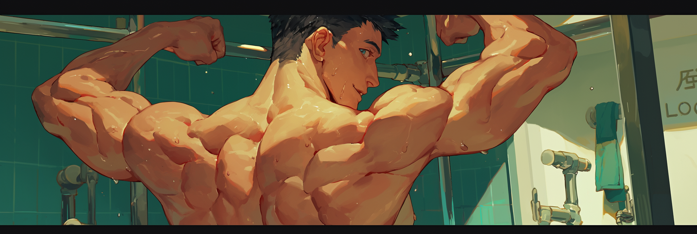

# Traits & Descriptors

## Descriptors

Descriptors in PLists are **short, functional details** that clarify traits, actions, or beliefs. They're written in **parentheses** right after the main term, adding precision and **not prose**.

### **How to Write Descriptors**

1. **Use parentheses `( )`** after each trait or action.
   * `voice(low)` → “voice” is the trait, “low” is the descriptor.
2. **Keep them literal and short.**
   * ✅ `smile(flat, slow)`
   * ❌ `mouth(tight like a locked vault)`
3. **Separate multiple descriptors with commas.**
   * `stance(relaxed, open, ready)`
4. **Avoid repeating the trait in the descriptor.**
   * ❌ `obsessive(obsessive, very obsessed)`
   * ✅ `aggressive(blunt, forceful)`
5. **Make descriptors useful, not decorative.**
   * **😐** `build(beefy, muscular, strong)`
   * ✅ `build(burly, dense muscle, broad shoulders)`

<figure><figcaption></figcaption></figure>

### **Formats**

| Format                             | Example                                               |
| ---------------------------------- | ----------------------------------------------------- |
| **Trait + One Descriptor**         | `hair(wavy)`                                          |
| **Trait + Multiple Descriptors**   | `eyes(green, wide, glassy)`                           |
| **Action + Object + Descriptors**  | `studies(others, quiet, calculating, long pauses)`    |
| **Abstract Concept + Descriptors** | `belief(love is dangerous, attachment weakens focus)` |

### **Types & Examples**

| Type           | Example Descriptors                            |
| -------------- | ---------------------------------------------- |
| **Appearance** | sharp, elegant, crooked, scarred, angular      |
| **Behavior**   | evasive, obsessive, measured, restrained       |
| **Emotion**    | burning, buried, flickering, numb              |
| **Scent**      | smoke, jasmine, wet stone, rust                |
| **Speech**     | clipped, melodic, abrupt, monotonous           |
| **Sexual**     | dominant, withholding, curious, possessive     |
| **Relational** | distant, overprotective, testing, manipulative |

### Breaking Down Complex Ideas

Think of it like summarizing the purpose or effect of a detail and not the full story.

Use this approach:

1. Distill the core idea
2. Cut unnecessary backstory
   1. _Write a note to yourself to supplement any necessary details later during the writing of Example Dialogs._
3. Label the emotion or belief clearly
4. Split details across multiple fields if needed

<figure><figcaption></figcaption></figure>

#### 1. Distill the Core Idea

Take long descriptions and turn them into **compressed, behavior-based notes**.



> “Taylor always acted friendly in public, but privately avoided real connection. She kept people close only when it benefited her.”



```txt
relationships(surface-level, self-serving, emotionally distant)
```



#### 2. Summarize Time Without Writing a Timeline

Don’t explain what happened year by year. Just name the **cause and effect**.



> “He started volunteering to make up for how aimless he felt after college.”



```txt
volunteering(purpose-seeking, post-grad uncertainty)
```

Or:

```txt
motivation(avoidance of aimlessness, desire for direction)
```



#### 3. Name the Emotion or Theme

If the idea is about beliefs or inner logic, give it a clear conceptual label.



> “She believes success is only real if others recognize it. Without praise, she feels like a failure.”



```txt
validation(external only, tied to achievement)
```

Or:

```txt
success(dependent on praise, internally hollow)
```



#### 4. **Split Big Ideas into Multiple Fields**

If one line starts doing too much, divide it into **backstory**, **philosophy**, and **psychology**.

**Example:**



> Jordan was homeschooled in a rigid, perfectionist household. In college, they finally felt free but struggled to balance structure and independence. They now over-plan everything and feel guilty when they rest.



```txt
BACKSTORY: homeschooled(strict routine, high parental standards), college(first taste of freedom, overwhelmed by choice);
PHILOSOPHY: freedom requires discipline, rest must be earned;
PSYCHOLOGY: guilt tied to rest, comfort in control, avoids unstructured time;
```



<figure><figcaption></figcaption></figure>

**Category Prompt Table**

Use these for inspiration or just to get your brain juice flowing.

| Category       | Traits/Descriptors                       |
| -------------- | ---------------------------------------- |
| **Appearance** | tall, hunched, scarred, clean, worn      |
| **Behavior**   | secretive, abrupt, consistent, obsessive |
| **Emotion**    | anxious, numb, boiling, fleeting         |
| **Sensory**    | leather, sweat, dust, bleach             |
| **Speech**     | slow, cheerful, blunt, monotone          |
| **Sexual**     | repressed, confident, attentive, intense |
| **Relational** | testing, needy, isolating, guarded       |
