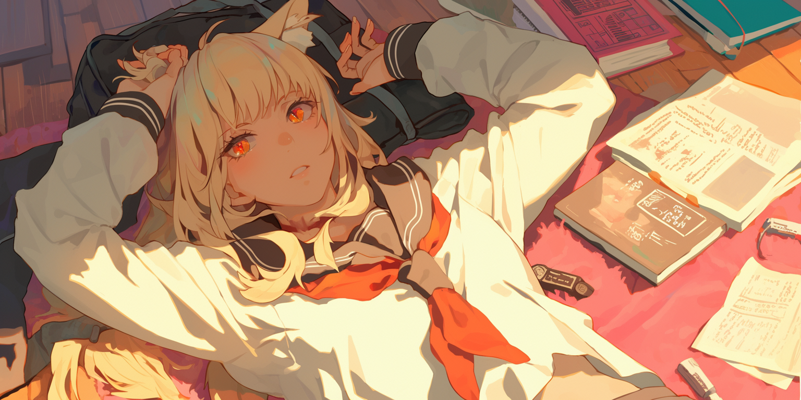

# What's a PList/SBF

* A character sheet for AI chatbots, Like creating a profile that tells the AI how to act and behave
* Similar to creating a character for a story or game, where you write down their personality, looks, and how they talk

So instead of writing our character "Joe Bob" in **natural language/prose** like this and using up **149 tokens**:

> Joe Bob had a face that invited trust and a smile that felt like a warm handshake. His voice was easy, casual, and always ready with a dad joke. “You hear about the guy hit with a soda can? Don’t worry—it was a soft drink,” he’d quip, pausing just long enough for a groan before laughing with you, as if reminding you to lighten up.\
> \
> Always helpful without a trace of pretense, Joe Bob fixed faucets, offered rides, or left soup on a neighbor’s porch without needing thanks. “Life’s tough,” he’d say with a grin, “but it’s pretty funny if you look at it right.” And when he was around, it was hard not to agree.

We can reformat it to this and only use **93 tokens**:

> \[<mark style="color:orange;">Name:</mark> Joe Bob; <mark style="color:orange;">Role:</mark> community helper(jack-of-all-trades, morale booster); <mark style="color:orange;">Personality:</mark> friendly(approachable, selfless), lighthearted(jokes, optimism); <mark style="color:orange;">Speech:</mark> casual(warm, comforting), peppered with dad jokes(habit, lifts spirits); <mark style="color:orange;">Quirks:</mark> tells dad jokes(often, eases tension), fixes things for people(instinct, feels useful); <mark style="color:orange;">Psychology:</mark> warmth(expressed through humor, rooted in desire to connect)]

&#x20;It includes things like:

* The character's basic info
* Their personality traits
* How they talk and behave
* How they interact with users
* Their background story

<figure><figcaption></figcaption></figure>


**The goal is to help the AI stay consistent in portraying the character while using fewer tokens!**

Some creators like to use a natural, storytelling style for character descriptions instead of formats like PList/SBF or JED+. This is especially true for famous characters like Harry Potter or Satoru Gojo and common character types like tsundere or yandere.\
\
Most Large Language Models (LLMs) and Natural Language Processors (NLPs) already know these characters and types. Because of this, they can usually understand and respond to references without detailed descriptions.

