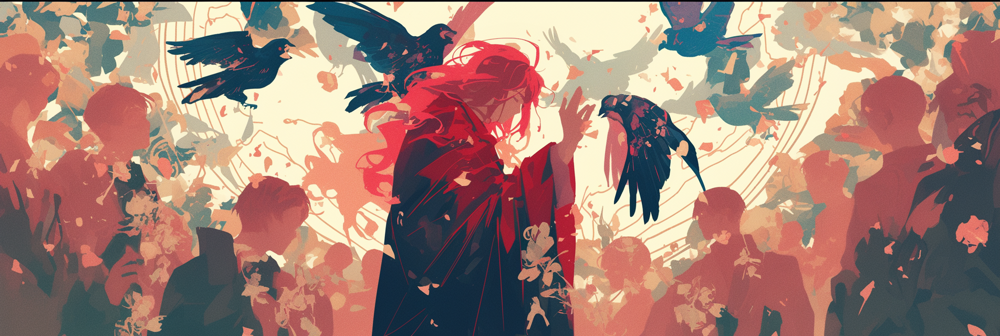
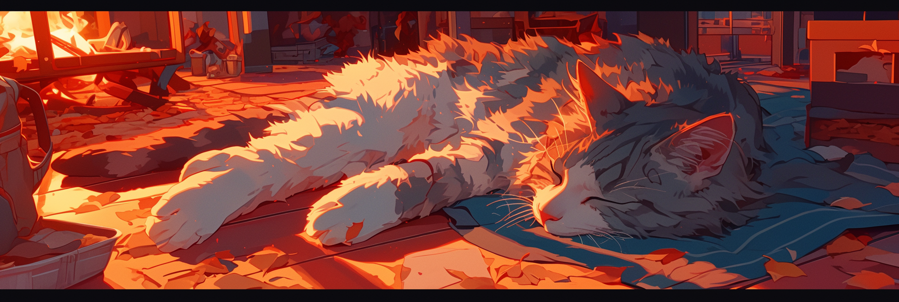

# Sampling Parameters/Generation Settings (ELI5)

I'm about to oversimplify the fuck out of sampling methods and parameters, skipping over crucial math, probability distributions, and the complex ways these settings interact. This is intentional. This guide is written for beginners to grasp these concepts without getting overwhelmed by technical details. If you need the proper technical depth, or just want to see what kind of research I did before writing this, [check out my citations](other/citations.md).

<a href="https://featherless.ai/docs/completions#v-1-completions">Featherless Supported Samplers</a>

Sampling parameters supported by Featherless will be <mark style="color:orange;">highlighted in orange</mark> but here's a quick reference.

| Paramter                     | Type            |
| ---------------------------- | --------------- |
| `model`                      | string          |
| `prompt`                     | string \| array |
| `presence_penalty`           | float           |
| `frequency_penalty`          | float           |
| `repetition_penalty`         | float           |
| `temperature`                | float           |
| `top_p`                      | float           |
| `top_k`                      | integer         |
| `min_p`                      | float           |
| `seed`                       | integer         |
| `stop`                       | array           |
| `stop_token_ids`             | array           |
| `include_stop_str_in_output` | boolean         |
| `max_tokens`                 | integer         |
| `min_tokens`                 | integer         |

## Basic Controls

These settings are the safest starting point for finetuning the responses you get from your favorite LLM!

### <mark style="color:orange;">Temperature</mark>

Think of it like a knob that controls how wild your output can get

**Range**: 0.&#x30;**–**&#x32;.0 (and sometimes higher)

* **Zero:** Completely predictable/greedy sampling
* **Low (e.g., 0.1-1.0):** Normal, sensible stories
* **High (e.g., 1.0-2.0):** Wild, creative stories

### <mark style="color:orange;">Min Tokens</mark>

How short do you want your output to be?

* Shorter responses might be cut short in the middle, which could interrupt your chat
* Suggested values:
  * _CharacterAI style:_ Start at `50` and adjust up or down according to your preference!
  * _Novel style:_ Start at `250` and adjust up or down to your preference!

### <mark style="color:orange;">Max Tokens</mark>

How long do you want your output to be?

* Longer responses take more time to generate
* Suggested values:
  * _CharacterAI style:_ Start at `100` and adjust up or down according to your preference!
  * _Novel style:_ Start at `1000` and adjust up or down to your preference!

<figure><figcaption></figcaption></figure>

## Repetition Controls

| Penalty Type         | When to Use It                                                                         |
| -------------------- | -------------------------------------------------------------------------------------- |
| `repetition_penalty` | 
To stop copy-paste-like behavior. Essential for making text feel human-like.
 |
| `frequency_penalty`  | 
To avoid overusing specific words. Helpful for concise, clear writing.
       |
| `presence_penalty`   | 
To encourage new ideas or vocabulary. Good for creative writing.
             |

### <mark style="color:orange;">Repetition Penalty</mark>

Determines how strictly an LLM avoids repeating words or phrases, helping maintain variety and natural flow in responses.

* **Low (e.g., 1.08–1.15):** Allows some repetition
  * Useful when repetition fits the context, such as a character's catchphrase or verbal tic

> Example: "I never go back on my word! That’s my ninja way! Dattebayo!"

* **High (e.g., 1.2–1.5):** Strongly discourages repetition
  * Forces the LLM to explore new words and expressions.

> Example: "The cat rested on the mat. It seemed comfortable." (No repeated use of "mat" here!)

### Rep Pen Range (Repetition Penalty Range)

<figure><figcaption></figcaption></figure>

Defines how far back the LLM considers for repetition.

* **Zero:** Checks every single response generated for repetition.
* **Small range (e.g. 512):** Focuses on avoiding immediate repetition (e.g., within a few words or sentences)
* **Larger range (e.g 1024):** Checks further back, reducing the chance of reusing words, phrases, or ideas from earlier parts of the conversation

### Repetition Penalty Slope

Adjusts how strongly repetition penalties are applied over time, following an S-shaped curve.

* **Flat curve (slope = 0):** No penalties; all words are treated equally
* **Steep curve (slope > 1):** Strongly discourages repetition, especially for recent words
  * Early words get little to no penalty, but recent repeats face higher penalties
* **Gentle curve (slope close to 0):** Balances variety while allowing some repetition when it makes sense


**Too low:** Results in excessive repetition, making the text sound dull

**Too high:** Avoids repetition too aggressively, leading to unnatural or overly complex responses


### <mark style="color:orange;">Frequency Penalty</mark>

Monitors how often specific words appear and discourages overuse by encouraging variety.\
Encourages the model to use a broader vocabulary and avoid unnecessary repetition.

**Range**: -2.0–2.0

* **Zero**: No penalty, the model may repeat words as it sees fit.​
* **Positive values (up to 2.0)**: Increase the penalty for repeated words, reducing repetition.​
* **Negative values (down to -2.0)**: Decrease the penalty, making the model more likely to repeat words.

> Example: If "cat" appears too frequently, the LLM might switch to related terms like "kitten," "feline," or "pet"

### <mark style="color:orange;">Presence Penalty</mark>

**Range**: -2.0–2.0

| Value          | When to Use It                                     | Example Effect                                                      |
| -------------- | -------------------------------------------------- | ------------------------------------------------------------------- |
| `0` (default)  | Neutral setting. Normal behavior.                  | Balanced output. Will reuse words naturally.                        |
| `0.5 - 1.0`    | Creative writing, story generation                 | Encourages variety. Avoids word reuse.                              |
| `1.5 - 2.0`    | Max creativity, brainstorming, idea generation     | Forces new vocabulary. May feel "artificial" or overly diverse.     |
| `-0.5 to -2.0` | Technical documentation, clarity, repetitive style | Allows repeating key terms often. Good for clarity over creativity. |

* Word-level penalty
* Reduces the likelihood of the model using a word _again_ if it has already been used.
* Encourages topic diversity and new vocabulary.
* **Does NOT** prevent repetition completely, just makes previously used tokens less likely
* **Does NOT** apply to _phrases_, just individual words/tokens (which may be whole words or word fragments).

<figure><figcaption></figcaption></figure>

## Word Choice Controls

### <mark style="color:orange;">Top K</mark>

Tells the LLM to only pick words it likes the most and ignores the rest.

* **Low (e.g., 3):** Pick only its very favorite words
  * More focused but might feel less random.
* **High (e.g., 50):** Pick lots of different words to play with
  * More creative and random but might make the story too unpredictable and nonsensical
* **-1 (Negative One):** All the words!
  * Might pick really strange words that don’t make much sense, because nothing is stopping it from considering even the least likely options.

> Example: instead of saying, "The cat sat on the mat," it might say, "The moonfish danced with a pineapple," because it didn’t narrow down the good choices.

### <mark style="color:orange;">Top P</mark>

Tells the LLM to _only pick the most popular words (low Top P)_ or _feel free to try some less popular words too (high Top P)._

* **Low (closer to 0):**
  * Only picks from the most popular words (the ones most people love)
  * Plays it safe and chooses words that make the most sense.

> Example: You might get something simple and clear like, "The cat sat on the mat."

* **High (closer to 1):**
  * Adds in some of the less popular words too, giving it more variety and creativity
  * Might choose something unexpected

> Example: Getting more creative but not too wild, "The curious cat danced on a sunny mat."

* **Highest (1):**
  * Any words are fine!
  * Might make responses very random and sometimes nonsensical because there’s no cutoff to focus on the most sensible or relevant choices.

> Example: Instead of saying, "The dog barked at the cat," you might get something unexpected like, "The cloud barked at the moon."

<figure><figcaption></figcaption></figure>

### <mark style="color:orange;">Min P</mark>

Decides how "safe" the LLM wants to play.

**Range**: &#x30;**–**&#x31;

* **Low:** Add unusual or unexpected words to make things more unique.
  * Might get creative or quirky, but sometimes picks something confusing.

> Example: "The cat astral projects."

* **High:** Stick to what makes sense.
  * Keeps things simple and easy to understand.

> Example: "The cat naps by the fire."

<figure><figcaption></figcaption></figure>

### Top A

Decides how picky the LLM wants to be with the words it uses.

* **Off (0):** Disables Top A sampling
* **Low (closer to 0):** Flexible and imaginative, but sometimes too kooky
  * Opens up to playing with less-favored words too
  * This makes it more creative, but sometimes it might pick something unusual

> Example: "The dog zoomed like a rocket."

* **High (closer to 1):** Picky and reliable
  * Sticks to its top favorite words (the ones with the best scores)
  * Keeps things simple and safe but less creative

> Example: "The dog ran fast."

### Mirostat


**Mirostat is at its best when you use it on its own.**

If you mix it with other methods like Top P or TFS, you might get word salad or endless looping.


Mirostat helps the LLM decide how surprising its words should be. Mode 1 is simpler and quicker, while Mode 2 is more creative but slower. Eta is like a speed dial for how fast the LLM changes its tone or ideas!

#### **Mode**

* **Mode 1** (Original Mirostat):
  * Guesses how surprising words should be based on a rule about word popularity (like Zipf's law: common words are used more than rare ones)
  * Sticks to a familiar way of thinking
  * Not too hard for LLM to decide (faster responses)
* **Mode 2** (Mirostat 2.0):
  * Tries to figure out which words are surprising without following a strict rule
  * Sorts word list by how interesting the words are, trimming it down, and then choosing from the shorter list
  * Takes a little longer, especially if there are lots of words to consider

#### **Eta**

Controls how fast your LLM reacts to changes while talking, like a speed dial for how fast the LLM changes its tone or ideas.

* **Low (e.g., 0.2–0.4):**
  * Takes its time to adjust and keeps the story steady and smooth

> Example: Tells a calm story that stays on track, like "The cat purred softly as it rested by the fire."

* **High (e.g., 0.8–1.0):**
  * Reacts quickly and makes more exciting or unexpected changes in the story

> Example: Might add surprises like, "The cat purred loudly, then leapt onto the wizard's spellbook!"

#### **Tau**

Tells the LLM how much randomness or surprise you want in the output.

* **Low (e.g., 2.0–4.0):**
  * Plays it safe and tells a simple, predictable story.
  * Everything makes sense, but it’s not super exciting or surprising

> Example: "The dog ran through the park and barked at a squirrel."

* **High (e.g., 6.0–8.0):**
  * Gets creative and adds more surprises or fancy details to the story.
  * It’s more imaginative, but sometimes it might get a little wild or unpredictable

> Example: "The dog sprinted through the luminous meadow, barking at an invisible orchestra of whispers."

<figure><figcaption></figcaption></figure>

### Typical

Keeps word choices consistent by steering clear of super rare or odd terms by balancing between being too predictable and too random (kind of like finding the sweet spot for making the story both interesting and understandable!)

* Checks how surprising or expected each word is compared to the others
* Doesn’t just pick the most popular or random words (tries to choose ones that feel right for the story)
* **Low (e.g., 0.1):** Keeps things safe and clear.
  * Sticks to very expected words that make sense and feel normal.

> Example: "The dog barked loudly."

* **High (e.g., 0.9):** Still making sense but adds more variety
  * Gets more creative and picks words that are a bit unexpected, but not too wild.

> Example: "The dog howled like a wolf under the moonlight."

### TFS (Tail-Free Sampling)

Helps decide how far down the list of word options it should go before cutting off the less useful ones. It keeps things fresh without going too far into nonsense!

* **Low (e.g., 0.1):** Keeps things simple and clear
  * Very strict and keeps only the most popular, logical toys (words).

> Example: "The cat sits on the mat."

* **High (e.g., 0.9):** More imaginative but still avoids the really weird stuff
  * More relaxed and includes some less popular toys (words), making its choices more creative.

> Example: "The cat ponders quietly on the mat of dreams."

* **Off (1):** Disables TFS sampling. Usually the default setting.

### Sampler Order

Decides the sequence the LLM follows to pick and arrange words in a story.

Imagine you're baking a cake, and you have several steps to follow—like mixing, adding sugar, and decorating. The order of these steps affects how the cake turns out:

* If you mix first, then adds sugar, and decorate last, the cake will probably turn out great
* If you decorate first, then mix, and add sugar last, the cake might turn out to be a disaster (i.e., word salad)

Similarly, in storytelling, changing the order of samplers can subtly shift the style and content of the response. Every language model is unique, so there’s no “perfect sampler order,” just like there’s no one-size-fits-all recipe for "cakes" when the cake in question could either be birthday cake, cheesecake or crabcake. Experimenting will help you find what works best for you!

* **Values and Corresponding Sampler:**
  * 0 = Top K
  * 1 = Top A
  * 2 = Top P
  * 3 = Tail-Free Sampling
  * 4 = Typical
  * 5 = Temperature
  * 6 = Repetition Penalty

<figure><figcaption></figcaption></figure>

### Beam Search

Tells the LLM to explore multiple story ideas at the same time to find the best one. It’s much smarter than just picking one word at a time without planning ahead!

1. Starts with a word, like _"The."_
2. Checks all the possible next words (like _"cat," "dog," or "bird"_) and keeps only the **top few best options.** These are called **beams**.
3. For each beam, it keeps building the story step by step, checking which ones make the most sense or sound the best.
4. At the end, it compares all the finished stories and picks the one that’s **most polished and coherent**.
5. Example:\
   If your LLM starts with _"The,"_ it might explore these beams:
   * **Beam 1:** _"The cat sat on the mat."_
   * **Beam 2:** _"The dog barked at the tree."_
   * **Beam 3:** _"The bird flew over the field."_\
     After exploring these options, the LLM chooses the best overall story.

By trying out multiple paths at once, Beam Search helps your LLM create responses that are clearer, more logical, and better connected. It’s like sending out “search teams” to ensure the best possible result!

### Epsilon Cutoff

Sets a threshold for the probability of words. Words that are too unlikely (below the cutoff) are skipped.

* **Epsilon = 0.001 (strict)**
  * Only keeps words that are very likely to fit.
  * Simple and logical, with no unusual choices.

> Example: _"The cat sat on the mat."_

* **Epsilon = 0.01 (relaxed)**
  * Allows slightly less common words, adding a touch of creativity.

> Example: _"The clever cat lounged on the velvet mat."_

* **Epsilon = 0.1 (very relaxed)**
  * Includes more rare words, which can lead to unique but sometimes strange outputs.

> Example: _"The inquisitive feline sprawled luxuriously on the silken mat of dreams."_

<figure><figcaption></figcaption></figure>

### Eta Cutoff

Considers how surprising or unexpected words are based on the overall word distribution. Words that stand out too much are skipped.

* **Eta = 0.1 (strict)**
  * Keeps only very expected and safe words.
  * Predictable and steady output.

> Example: "The cat sat by the fire."

* **Eta = 0.5 (balanced)**
  * Allows for more variety while still avoiding very risky words.

> Example: "The cat purred softly by the warm fire."

* **Eta = 1.0 (relaxed)**
  * Accepts highly surprising or unusual words, leading to creative or quirky outputs.

> Example: "The luminous cat purred, basking in the glow of an enchanted hearth."


**Key Difference Between Epsilon and Eta**

* Epsilon: Focuses on how likely each word is individually.
* Eta: Focuses on how much a word stands out compared to the others.


### Dynatemp Exponent

Creativity speed dial to decide how fast your LLM gets imaginative as it tells its story!

1. **Low (e.g., 0.1–0.5)**
   * Slow and steady creativity
   * Logical and predictable output
   * **Example:**
     * _Start:_ "The cat sat on the mat."
     * _Later:_ "It purred softly, enjoying the warmth of the afternoon sun."
2. **Moderate (e.g., 1.0–1.5)**
   * Balanced creativity
   * Adds flair without being too wild
   * **Example:**
     * _Start:_ "The cat sat on the mat."
     * _Later:_ "It stretched out, then leaped toward a dancing beam of light."
3. **High (e.g., 2.0–3.0 or higher)**
   * Creativity increases quickly
   * More imaginative but may risk being too random
   * **Example:**
     * _Start:_ "The cat sat on the mat."
     * _Later:_ "The cat yawned, then sprang onto the wizard’s glowing staff to bat away sparkling stars."

<figure><figcaption></figcaption></figure>

#### Dynatemp Min & Max

Remember how the [Temperature ](sampling-parameters-generation-settings-eli5.md#temperature)is like a knob that controls how creative LLM gets? Dynatemp Min and Dynatemp Max are like setting a starting point and an ending point for that knob.



**Dynatemp Min:** Where the creativity knob starts at the beginning of the story.

* **Low:** Story starts simple and sensible.
* **High:** Story starts wild and creative.



**Dynatemp Max:** Where the creativity knob ends as the story goes on.

* **Low:** Story calms down and becomes more focused.
* **High:** Story gets even more imaginative as it unfolds.



**Example:**

1. Start creative, end sensible:
   * Dynatemp Min = 0.9 (high), Dynatemp Max = 0.3 (low)
   * "The magical cat soared through the stars. Eventually, it curled up on the mat, purring quietly."
2. Start simple, get creative:
   * Dynatemp Min = 0.3 (low), Dynatemp Max = 0.9 (high)
   * "The cat sat on the mat. Then, it leaped into the air and chased a beam of magical moonlight."



### Length Penalty

Helps the AI decide if longer or shorter responses are better.

* **On:** The LLM looks at how long its response is getting and adjusts how likely it is to use certain words
  * It's not just about making things shorter. It's about making the length feel right for the story being told
  * It might prefer shorter or more focused answers because long stories could be seen as less ideal.
  * As the response gets longer, the AI might start favoring words that help wrap up the story naturally
* **Off:**
  * The LLM doesn’t care about how long the story gets.
  * It might go on and on, adding more details or extra words.
* **Example:**
  * **Length Penalty ON:**\
    &#xNAN;_"The cat sat on the mat."_\
    (Short and sweet!)
  * **Length Penalty OFF:**\
    &#xNAN;_"The cat, feeling warm and happy, sat on the mat by the fire and purred softly as the sun sets."_\
    (More details and a longer response!)

<figure><figcaption></figcaption></figure>

## Additional Controls

### DRY (Don't Repeat Yourself)

DRY looks at the words the AI has already used and adjusts how likely it is to use them again.

* When the LLM uses a word, DRY remembers it
* If a word was used recently or frequently, the LLM is less likely to pick it again
* Common words are affected less than unique or specific words (like 'the' or 'and')
* This helps keep responses fresh and varied without sounding unnatural

### Temperature Last (Final Seasoning)

* Like adding spices to your food at the very end
* Makes sure everything still tastes good
* Adds just the right amount of creativity

### Word Ban (No-No Words)

* Like having a list of words you're not supposed to use (i.e: slop)
* Helps keep conversations nice
* Makes sure stories stay on topic

<figure><figcaption></figcaption></figure>

### Using Top K and Top P Together

Both can work together or separately to help the LLM make better word choices, but when used together:

1. The order they're applied in matters (check your [Sampler Order](https://rentry.co/ps7ni5tb/edit#sampler-order))
2. Either one can filter first
3. Both help reduce the pool of words the LLM picks from, just in different ways

* **Top K**
  * Keeps only a specific number of choices
  * **Think:** "Only look at the top 40 possible next words"
* **Top P**
  * Keeps choices based on their combined probabilities
  * **Think:** "Keep the most likely words until their probabilities add up to 90%"

## Remember

* What works for one LLM might not work for another
* There's no perfect way to set things up. It's all about what kind of stories you want to hear from LLM
* If something doesn't make sense, try changing one setting at a time
* Keep track of what changes you make
